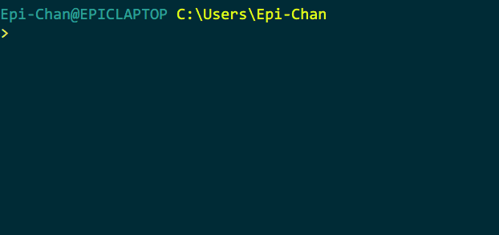
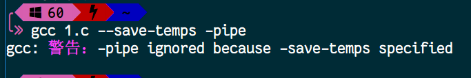
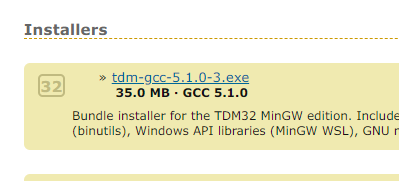
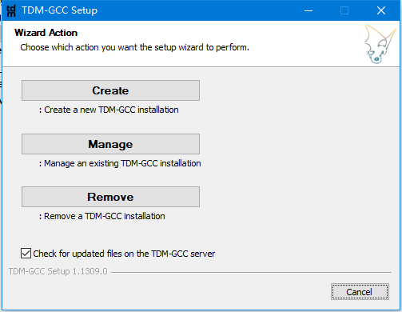
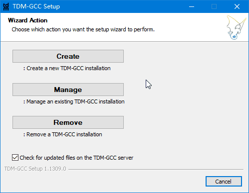

# 在命令行下编译 C 语言 (安装过程特指 Win)

有同学说，我电脑配置极低，VS 通常启动和使用较慢，怎么通过命令行编译 C 程序？

以前也确实遇到过这个情况，一台处理器为 U 的内存只有 2G 的电脑结果跑了一个 Win 8，这个环境下跑 VS 肯定是不方便了，连 Dev 也很慢。
所以，如果学了一点命令行基础的，用命令行无疑是最合适的。动不动就看到一些个人服务器就一核处理器和 512M 的内存，带个 Minimal 的系统都不吃力。
接下来就是要介绍怎么在命令行下编译和运行程序，这里使用的是 MinGW 的 gcc

如果你是 Linux，只是想学编译选项的话：[Click](#%E4%B8%80%E4%BA%9B%E7%BC%96%E8%AF%91%E9%80%89%E9%A1%B9)，Mac 上 clang 的选项也大致相同

## 前置条件

阅读本文前，我假定你已经有一定的命令行功底，懂得 [Win 环境下最基本的命令行操作](https://github.com/m4XEp1/Epis-Knowledge-Repo/blob/master/Terminal%20Tutorial/README.md#%E6%88%91%E4%BB%AC%E7%94%A8%E5%87%A0%E4%B8%AA%E5%91%BD%E4%BB%A4%E6%9D%A5%E5%85%A5%E9%97%A8-cmd)

## 什么是 gcc

gcc，全称 GNU Compiler Collection，就是一套编译工具链。我们把一个或多个代码文件交给 gcc 后，它负责调用 cc1 程序生成经过预处理的 .i 文件，之后 cc1 拿着这些 .i 生成 .s 的汇编文件，之后 gcc 拿着这些汇编文件交给 as 程序让它生成 .o 的二进制代码文件，最后 collect2 程序把这些二进制代码文件链接到一起，生成一个可执行文件

安装过程只讲 Win，Linux 基本上都是自带

## 下载 gcc (x64)

到 [这里](https://nuwen.net/mingw.html) 下载 MinGW，页面的 Download 处有一个 mingw-[version]-without-git，下载它

如果你是 32 位系统，[往后看](#如果你是-32-位的系统)

完成后，双击运行，解压到你想要的位置

## 添加环境变量

在命令行那篇文章里提到过，要想在命令行下运行一个文件，就得去到它所在的那个路径。但是如果我们每次都要去到 gcc 所在的文件夹，再写上一长串的路径去编译文件，岂不是很麻烦？为此，我们要把 gcc 的路径添加到环境变量里去

在你解压的目录下，有一个叫做 `MinGW` 的文件夹，打开它，里面有一个 `bin` 目录，打开，复制当前的路径

右键计算机 -> 属性 -> 高级系统设置 -> 环境变量 -> 系统变量 -> 双击 Path

### 如果你在 Win10

在新出来的窗口里点击新建，粘贴你复制下来的路径，然后点击确定，所有的窗口都是确定，没有可以点击确定的窗口点击关闭

### 如果你不是 Win10

在弹出来的窗口的变量值的末尾，加上一个 `半角冒号`，之后粘贴你复制的路径，点击确定

## 测试是否正确

```batch
> gcc
```

输出的如果不是`不是内部或外部命令`的话，就算是安装成功了

你也可以用 `gcc --version` 来查看当前安装的 gcc 版本

```batch
> gcc --version
```

如果你添加变量前就已经打开了 cmd 的话，重启之后新的环境变量才会生效

## 编辑你的代码

你可以打开记事本，编辑，之后保存为 .c 后缀的代码文件。或者使用 Sublime，Nodepad++ 等工具作为你编辑代码的工具

## 文件编码问题

如果你用的是记事本来写 .c 文件，文件里的中文输出的时候不会有问题，如果是 Sublime 和 VS Code 等的编辑器的话，由于 cmd 的字符编码默认是 GBK，而 Sublime，VS Code 默认为 UTF-8，程序输出时会造成乱码

解决方案如下

### Sublime

Ctrl + Shift + P，之后在弹出的框里输入 `Install Package Control`，回车

等待若干秒后，会弹窗出现安装成功的提示，点击确定关闭。接着 Ctrl + Shift + P，敲 `Install Package`，过一会会出来一个列表，输入 `ConvertToUTF8`，按回车即可安装

安装完成后会出现一个 Package Control Message，就是安装成功了

接下来重启你的 Sublime，在下次写代码遇到中文的情况，菜单栏 -> File -> Set File Encoding To -> Chinese Simplified(GBK)

某一些魔改版 Sublime 会带上这个插件，视情况而定，如果已有就直接使用吧

### VS Code

右下角的空格旁边有一个文字编码信息，单击后上方有个 通过编码保存，往下滑，有一个 Chinese(GBK)

### Nodepad++

菜单栏 -> 编码 -> 编码字符集 -> 中文 -> GB2312

## 一些编译选项

gcc 编译器提供了很多编译选项，涉及范围广，下面逐一解释常用的编译选项

接下来的代码文件假设为 Hello.c

还是要啰嗦一下，接下来的命令均假设你在 Windows 平台，> 是 cmd 的 prompt，而不是让你输入 >

当然我会用一些非 Win 的截图，这个就不说了

### 默认编译

以 gcc + 代码文件名字

```batch
> gcc Hello.c
```

生成的程序文件名字是 `a.exe`，默认不显示警告



### 编译并生成自定名字程序

```batch
> gcc Hello.c -o main
```

意思是生成一个叫做 `main.exe` 的程序

也可以是：

```batch
> gcc -o main Hello.c
```

注意，如果你看这篇文章的时候用的是 Linux 下的 gcc 或者是 Mac 下的 clang，-o 后面的文字是不会加上 .exe 的

### 保存编译过程中的临时文件

编译过程中经历了 预处理、编译、链接，中间是有临时文件生成的

如果你想保存这些文件：

```batch
> gcc Hello.c --save-temps
```

### 只做预处理，不进行编译汇编和链接

```batch
> gcc -E Hello.c
```

如果不指定 -o 的话，默认将预处理的结果输出到 stdout

你可以指定输出文件，如

```batch
> gcc -E Hello.c -o Hello.i
```

或者使用 batch 自带的重定向

```batch
> gcc -E Hello.c > Hello.i
```

### 只做编译，不进行汇编和链接

```batch
> gcc -S Hello.c
```

生成 .s 汇编代码文件

### 只做编译和汇编，不做链接

```batch
> gcc -c Hello.c
```

生成 .o 机器码文件

### 打开警告信息

```batch
> gcc Hello.c -Wall
```

意思是打开大多数的警告

格式为 -W+警告类型

如 -Wmain 就是显示对 main 的警告

你可以使用下面的命令查看更多的警告选项

```batch
> gcc --help=warnings
```

### 让 gcc 优化代码

```batch
> gcc Hello.c -O2
```

意思是让 gcc 对代码做 O2 优化，大部分情况下只用 -O2，优化开高了可能对程序造成影响

* -O0
* -O1
* -O2
* -O3
* -Os
* -Ofast
* -Og

你可以使用下面的命令查看更多的优化选项

```batch
> gcc --help=optimizers
```

### 显示编译过程

```batch
> gcc Hello.c -v
```


### 每个子进程所用的时间

```batch
> gcc Hello.c -time
```

gcc 是一套工具链，在开头就讲过，`-time` 选项目的是把子进程的耗时给显示出来

### 使用管道代替临时文件

```batch
> gcc Hello.c -pipe
```

这个选项会在 --save-temps 选项存在时忽略



### 遵循标准的编译

```batch
> gcc Hello.c -std=c99
```

意思是用 C99 的标准去编译这个文件，小写 c

类似的还有 C11, C89, C90, C9x, C1x, gnu89 等等等等……

### 链接静态库

静态库是指在我们的应用中，有一些公共代码是需要反复使用，就把这些代码编译为 "库" 文件; 在链接步骤中，连接器将从库文件取得所需的代码，复制到生成的可执行文件中的这种库

库文件在你安装目录下的 lib 目录，64 位下还有一个 32 位的库

它们长这个样子：


链接的选项为 -l + 库名称

如：

```batch
> gcc server.c -lws2_32
```

意思就是链接图片上那个叫做 libws2_32.a 的静态库文件

文件名字是 lib 开头，你在编译选项里就掐头 (lib) 去尾 (.a)

至于什么之后要用到链接库呢……就看你的开发内容啦

### 指定 include 的目录

还记得吗，在代码中，include 的 <> 和 "" 是不一样的。<> 会在编译器指定的位置去找，而 "" 是先在用户的头文件里找，找不到再去指定的位置找

要指定这个 include 的位置，可以使用 -I 选项

```batch
> gcc -I[path]
```

如
```batch
> gcc -I"C:\Program Files (x86)\Dev-Cpp\MinGW64\lib\gcc\x86_64-w64-mingw32\4.9.2\include" Hello.c
```

### 指定静态链接库的目录

和 include 一样，编译器有个默认的静态库目录

若要自定，可以使用 -L 选项

```batch
> gcc -L[path]
```

如
```batch
> gcc -L"C:\Program Files (x86)\Dev-Cpp\MinGW64\lib" -L"C:\Program Files (x86)\Dev-Cpp\MinGW64\x86_64-w64-mingw32\lib" Hello.c
```

和指定 include 路径一样，-L 后面直接带上路径，不要有空格

## 如果你是 32 位的系统

32 位系统可以选用 TDM 的 gcc

进入 [TDM 官网](http://tdm-gcc.tdragon.net) ，点击 Download

下方 Installer 处有一个带着 32 图标的链接，单击它，会跳转到 SourceForge 的网站进行下载



下载完成后，双击安装，点击第一个选项 `Create`



接下来读条结束后，保持默认的那个选项 (32-bit)，点击两次 `Next`

选择路径，你也可以保持默认，点击 `Next`

接着会问你要使用那个地方的镜像，点击 `Next` 就好了，就从默认的 SourceForge 下

接下来的选项保持默认就好了，它会帮你添加到系统的环境变量 (PATH) 里，点击 `Install`

等待读条结束，单击 `Next`，取消打钩 `Read the TDM-GCC README file (recommend)`，然后点击 `Finish`



接下来就可以打开你的 cmd 敲 gcc 了

你会发现其实 TDM 也有 64 位的 gcc，而且安装的时候还不需要配置环境变量这种东西

但是为什么在 64 位上我们建议使用 MinGW 的 gcc 呢…… `gcc --version` 会给你答案的

## 后记

### 为什么我们选择命令行？

如今的电脑配置参差不齐，不一定都能带的动吃配置的怪物 VS (当然至少要流畅运行) ，但是 gcc 这种命令行的东西很轻快，它自己的大小也就一兆左右，编译又相当的迅速。最重要的是，没有 GUI 可以省下一大笔内存和配置，何乐而不为

而且，命令行更显得自己专业啊有木有 qwq

### 卸载和升级

如果你选择的是 MinGW64 的 gcc，卸载非常简单，直接删除那个文件夹就好了

如果你选择的是 TDM-GCC，在控制面板卸载就好

MinGW64 的 gcc 升级只需要删除文件夹后下载新的版本就好了，或者解压覆盖

TDM-GCC 同理，卸载后重装新版本就行

### 解读一些命令的意思

可能这么写会有点懵，或者换个方法说，这些选项示例都是单个出现的，如果我想同时使用多个选项呢？

比如我找来了一段编译命令

```batch
> gcc -o server -O2 -std=c1x -lws2_32 server.c --save-temps -Wall
```

意思就是，生成的文件名字是 server.exe，使用 O2 优化，遵循 c1x 的标准，链接 libws2_32.a 的静态库，源文件是 server.c，保存临时文件，打开大多数警告