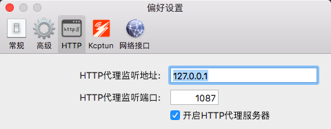
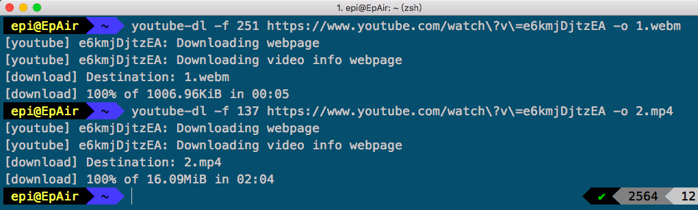
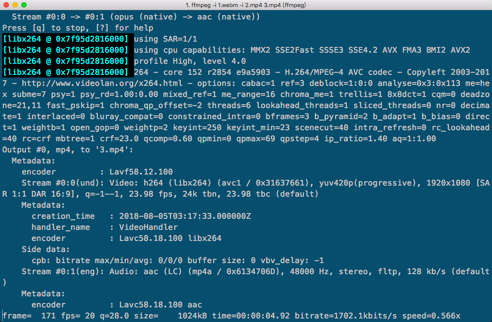

= 使用 youtube-dl 下载 YouTube 视频

== 前言

给 Timothy 老师搬运教学视频到 B 站也有一段时间了，在以前我用的是 IDM，
但由于贫穷限制了我的行动，我没法购买正版的 IDM。后来用 5K Player，
但是这玩意每次使用都会强制修改文件的默认打开软件，比较流氓。而直接使用 youtube-dl 下载的话，
YouTube 的视频在 720 P 以上的分辨率是音视频流分开的。最后张秋怡前辈给了个意见，
用 ffmpeg 合成下载到的 video only 和 audio only，所以有了此文

== 前提说明

本文不提供任何的科学上网手段！请自己准备！

== 详细步骤

=== 下载 youtube-dl

在 mac 上比较简单，使用 brew 就可以了

[source,shell]
----
$ brew install youtube-dl
----

如果你在 Windows，可以在 https://github.com/rg3/youtube-dl[youtube-dl 仓库] 的 release 找到 Windows 可用的 .exe 可执行文件

=== 下载 ffmpeg

在 mac 上同理，使用 brew

[source,shell]
----
$ brew install ffmpeg
----

Windows 可以在 ffmpeg 的 http://ffmpeg.org/download.html#build-windows[官网]下载。
步骤不做过多赘述

=== 配置环境变量

在这里讲述的是使用代理工具需要设置的，如果你使用的是 VPN，可以跳过此步骤

==== mac 平台

shadowsocks 等代理工具都会有一个本地监听端口，把端口值添加到环境变量。比如以下图的值作为添加

[source,shell]
----
$ http_proxy=http://127.0.0.1:1087
$ https_proxy=http://127.0.0.1:1087
----

如果你想以后使用不用再重新配置，可以将它添加到 rc 文件里

[source,shell]
----
$ echo 'export http_proxy=http://127.0.0.1:1087' >> .bashrc
$ echo 'export https_proxy=http://127.0.0.1:1087' >> .bashrc
----

注意，此处假定你使用的是 bash。如果你使用的是 zsh，将 `.bashrc` 改成 `.zshrc`

==== Windows 平台

[source,batch]
----
> set http_proxy=http://127.0.0.1:1087
> set https_proxy=http://127.0.0.1:1087
----

TIP:在 Windows 上的 shadowsocks 默认的端口号是 1080

=== 下载视频

在 YouTube 看视频的时候，把视频页的链接复制下来，先查看可用的音视频文件

这里假定使用 https://www.youtube.com/watch?v=e6kmjDjtzEA[Nike Zoom Pegasus Turbo Breaking2 to You] 这个视频作为例子

(因为之前我们说过了，720 P 以上画质的视频是音视频流分开的，如果挑选了一个 720 P 或者以下的，那还不如直接下载)

[source,shell]
----
$ youtube-dl -F "https://www.youtube.com/watch?v=e6kmjDjtzEA"
----

TIP:如果此时并没有出现下图的信息，那么很可能你的代理 / VPN 并不起作用，请返回检查你的配置

`-F` 选项是 list formats 的意思，过一会工具就会下载好该视频的所有质量音视频的信息

image::info.png[]

图中的 format code 是我们应该记下来的，因为我们要找到质量最佳的音频代码和视频代码

extension 是格式，这个不用在意，因为 ffmpeg 在合成的时候会合成你想要的格式

resolution 是分辨率

图中，音频最高质量的是 format code 为 251 的那一列，视频最高质量的是 137

接着我们开始下载这两个文件：

[source,shell]
----
$ youtube-dl -f 251 "https://www.youtube.com/watch?v=e6kmjDjtzEA" -o 1.webm
$ youtube-dl -f 137 "https://www.youtube.com/watch?v=e6kmjDjtzEA" -o 2.mp4
----

`-f` 后面带上 format code 意思是即将下载 code 所对应的音视频文件，`-o` 的意思是将下载的文件重命名

下载完成后，开始使用 ffmpeg 合成

=== 合成音视频

[source,shell]
----
ffmpeg -i 1.webm -i 2.mp4 3.mp4
----

`-i` 的作用是标记**输入**文件，而没有的时候也就意味着**输出**文件了

此处假定你下载好的音频文件已经改名为 `1.webm`，视频文件改名为 `2.mp4`，要合成的目标文件叫做 `3.mp4`

当然，你可以自己选择输出的视频格式，只需要更改后缀就行了

正在合成的时候，命令行窗口最下方会有正在处理的信息，如图：

其中，`frame` 代表的是已经处理的帧数，`size` 是已经完成的大小，`time` 是已经完成的视频的时长，
`speed` 是一秒内能完成多长时间的视频。

过一段时间后，就完成了。如果你下载的视频比较长，可能需要很长一段时间，以处理器鸡肋程度为准

