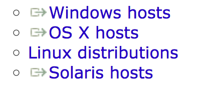

# 安装 Ubuntu (虚拟机)

本文将介绍在电脑上用虚拟机的方式安装 Ubuntu 操作系统

## 先决条件

本文所使用的虚拟机为 VirtualBox，并且个人认为 VirtualBox 在某些方面的配置还算比较方便的，并且由于我已经弃用了 Windows，VMware 方面的些许问题就照顾不到了

关于 VirtualBox 的安装就不做详细说明了，下载地址在：https://www.virtualbox.org/wiki/Downloads#VirtualBoxbinaries ，根据你的操作系统选择对应的 hosts 就可以

## 目录

* [安装 Ubuntu 桌面版](https://github.com/m4XEp1/Epis-Knowledge-Repo/blob/master/Install%20Ubuntu/Ubuntu%20GUI/README.md)
* 安装 Ubuntu 服务器版 (没有图形化界面)
