# 安装 Ubuntu 桌面端

## 下载系统镜像

打开 Ubuntu 的[中文官网下载页面](http://cn.ubuntu.com/download/)，页面上有个 Ubuntu 和优麒麟。此处讲的是 Ubuntu，你可以将本文看完之后根据自身需要日后自行安装优麒麟

往下还有一个更新的版本，写此文的时候将用 16.04 的 Ubuntu 来做说明

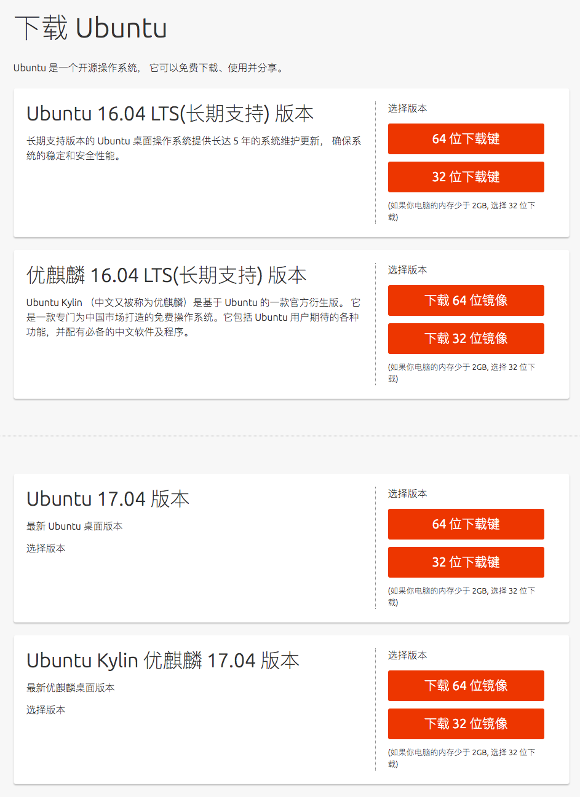

根据自身的机器来选择系统位数，就不多扯了

建议使用迅雷等支持 P2P 的下载工具来进行下载，时间省的可不是一点点

## 配置虚拟机

### 新建

打开 VirtualBox，点击新建，名字可以自己定义，类型是 Linux，系统位数选正确就行了，点击继续

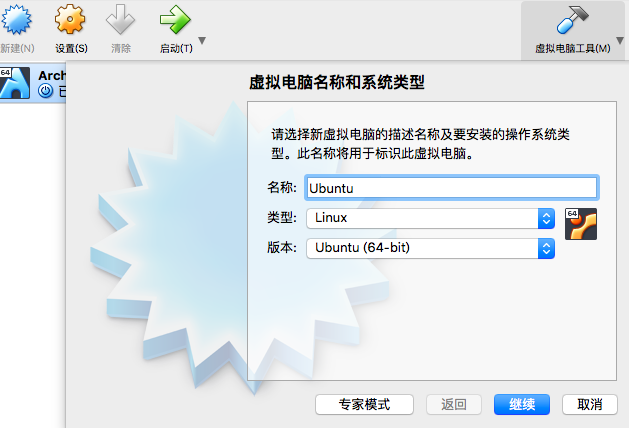

接下来是分配内存，针对 Ubuntu 我建议分配 2G 以上，点击继续

选择“现在创建虚拟磁盘”，点继续

选择 VirtualBox 自家的 VDI 格式，点继续

存储类型你可以选择固定大小和动态分配，无伤大雅，点击继续

大小的话我建议是 10G 以上，如果是动态分配的话不会立即占用，10G 对于动态分配来说是告诉虚拟机“你能在磁盘使用的上限”，点继续

### 配置优良性状

不要着急启动，我们现在连系统镜像都没有设置

点击设置，这里将逐步讲解每个地方的配置

1，系统。主板部分，取消打钩光驱，把光驱往上移至最顶，硬盘在它的后面。指点设备修改成 PS/2 鼠标

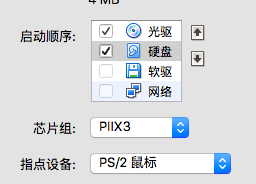

处理器部分，数量就增加至绿色和红色的中间，打钩 “启用PAE/NX”

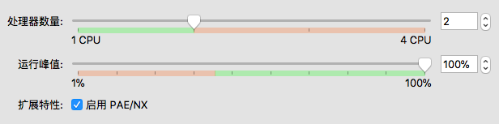

硬件加速部分就不予理会了，保持默认就行

2，显示。屏幕部分，把显存开到最高

确保远程桌面和录像都没有打开

3，存储。点击“控制器：IDE” 下方的“没有盘片”，在右边有个光盘的图标，点击之后“选择一个虚拟光盘文件”，然后选择你下载了的镜像

4，声音。可以关闭也可以保持默认

5，网络。确认连接方式是 NAT

6，端口。确认串口下的所有端口都未启用，USB 设备保持默认打开的状态

点击 OK，保存配置

## 启动虚拟机

点击启动，这时候虚拟机就会开始启动了

等待一会，会进入一个选择语言的界面，选择简体中文，点击试用 Ubuntu

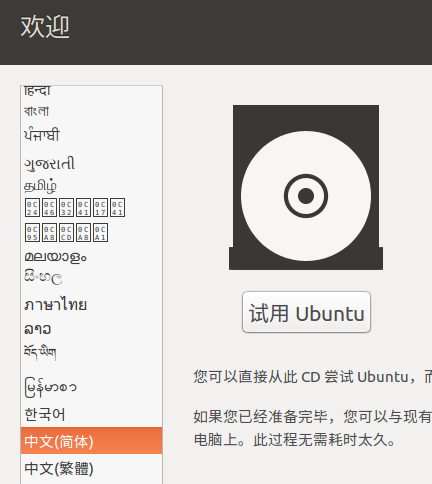

等待一会，进入 Ubuntu 的桌面，这时候你就已经可以使用上面的功能了，哪怕你还没有开始安装。比如命令行各种工具等

你可以放大虚拟机窗口来同时放大虚拟机的桌面

## 安装

### 配置镜像

中国网络比较魔法也不是一两天的事情了，当然中国有 Ubuntu 的镜像

打开设置，它是一个齿轮和扳手的图标，在右边的 dock 上，点击系统部分的软件和更新

下载自的部分，选择其他站点

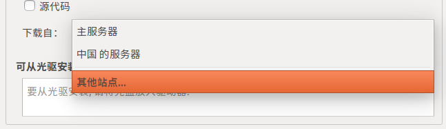

在中国的部分有很多可使用的源，我建议使用下面三个源中的其中一个

* mirrors.aliyun.com 阿里云镜像
* mirrors.ustc.edu.cn 中科大镜像
* mirrors.tuna.tsinghua.edu.cn 清华源镜像

选择之后，点击“选择服务器”

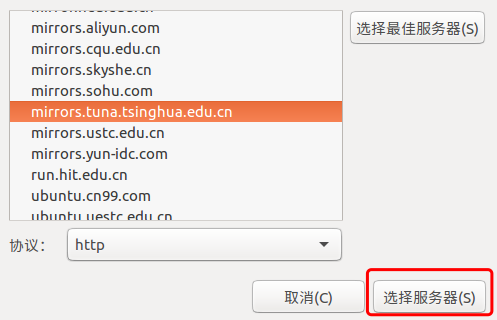

回到软件和更新，点击关闭，会弹出一个过时的提示，点击重新载入，接着会有一段时间来更新缓存，等待就好

结束之后会自动关闭，这时候就可以点击安装了

### 安装系统

桌面上有一个安装，双击

语言仍然是中文(简体)，点击继续

你可以打钩“安装 Ubuntu 时安装更新”，也可以直接点击继续。不打钩安装用的时间会少一些

安装类型保持默认的“清除整个磁盘并安装 Ubuntu”，点击现在安装

弹出一个硬盘分区的提示，点击继续就行，它已经帮你分区好了

弹出地图的时候点击中国的位置，点击继续

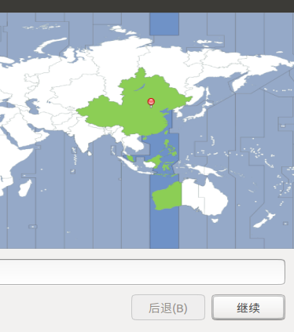

键盘布局就是默认的双汉语，点击继续

配置用户信息这个跟着感觉走就行了，点击继续，开始安装系统

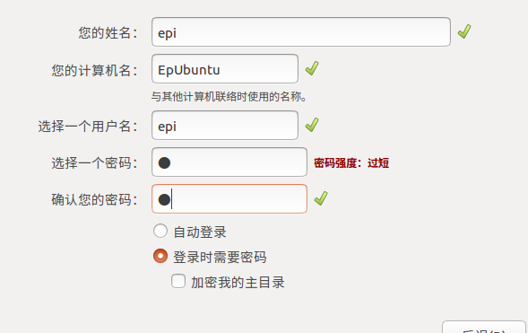

大概会使用几分钟到十几分钟的时间(基于我自己渣配的电脑算的)，期间可以在宿主机上干点别的事情

安装完成后，点击现在重启

过了一会会提示移除安装媒介，直接按回车就行了，过一会便会重启

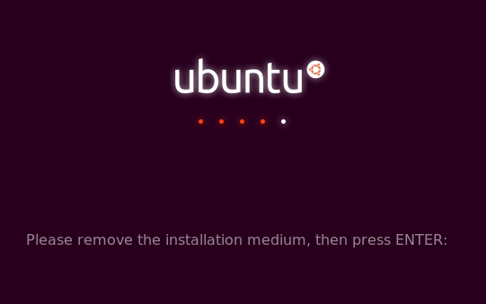

## 配置开发环境

### 登陆

这个地方就不多讲了

### 配置镜像

和安装前的步骤一样，不再过多说明，仅仅是多了一个密码验证

不做这一步的话下载包的时候会比较慢

### 打开终端

打开终端，左上角有一个 Ubuntu 的标志，打开之后搜索 Terminal (毕竟没有配置中文输入法)，打开终端


### 升级原有包

```bash
$ sudo apt-get upgrade
```

提示确认升级的时候，Y 后按回车

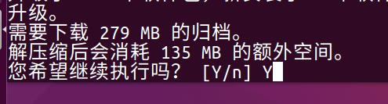

安装过程你会发现，下载的时候链接都是中国的，速度会很快

如果提示错误，会问你要不要加上 --fix-missing

```bash
$ sudo apt-get upgrade --fix-missing
```

然后等待就好了

结束的标志是，等待你输入新的命令的时候

### 安装你所需要的开发工具

Ubuntu 的包管理器是 apt，但是我们不要急着去 install，因为它的列表比较奇怪，先去敲，如：

```bash
$ node
```

然后它先检测有没有安装，再去自己的软件列表里看看是否有这个东西，然后提示你怎么安装

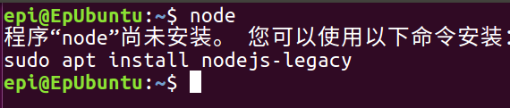

然后你就可以看着提示命令来安装了

```bash
$ sudo apt install nodejs-legacy
```

当然这里不是让你安装 node 啊，只是用这个来做个示范而已

你要用什么就先敲，看看它提示的安装命令来安装就可以了


## 后期

### 勤升级

```bash
$ sudo apt-get upgrade
```
