# 安装 Ubuntu 服务器版 (Minimal)

## 下载镜像

打开 Ubuntu 服务器的下载页面 https://www.ubuntu.com/download/server ，仍然是两个版本，这里就讲 17 的吧

~~16 的安装过程中我遇到了很多很多问题，导致最后并没有成功~~

总的来说就是：我还是太菜了

点击 Download 之后可能会等待很久都没有下载，你可以点击页面上的“download now”

## 配置虚拟机

这个就不多做说明了，和[桌面版](https://github.com/m4XEp1/Epis-Knowledge-Repo/blob/master/Install%20Ubuntu/Ubuntu%20GUI/README.md#%E9%85%8D%E7%BD%AE%E8%99%9A%E6%8B%9F%E6%9C%BA)的一样

唯一要特别说明的是：

1 无视无效设置，把显存调至 4M

2 系统 -> 主板，打钩 `启用 EFI`

3 分配光盘镜像的时候，打钩 `演示(Live)光盘`

4 在声音处，取消打钩 `启用声音`，命令行要什么声音

## 安装

启动之后，等待若干秒，会弹出 grub 引导的界面，这时候高亮处默认就是安装 Ubuntu

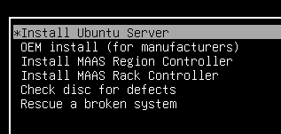

按下回车，等待一会就会进入到安装程序了

语言处把光标用上下方向键移动到中文（简体），按回车

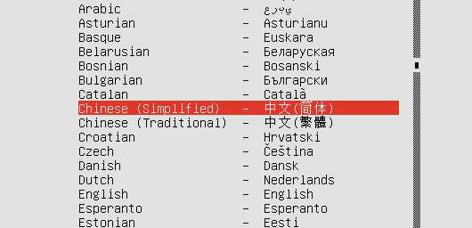

接着会提示安装器的翻译不完整，这里无视它，高亮 是 按下回车就好了

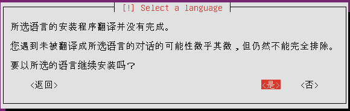

接着会问你的区域，选中国

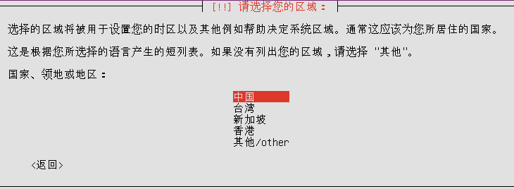

它会问你要不要检测键盘布局，选择否

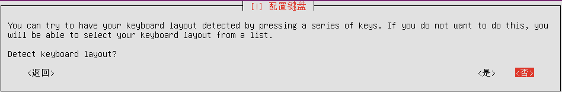

接着问你键盘所属的国家，选择 Chinese，按回车

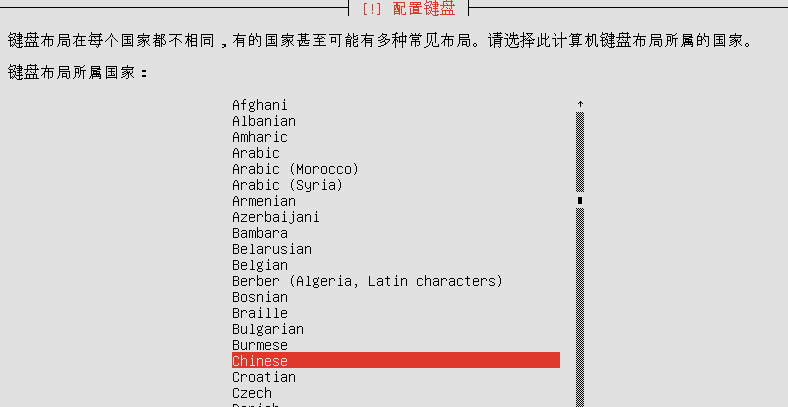

接着到键盘布局，选择 Chinese

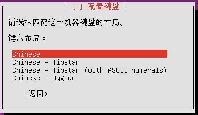

接着等待一小会，Ubuntu 安装程序会加载一些组件和设备

加载完成后，会让你输入主机名字，这个跟着感觉走，之后敲回车

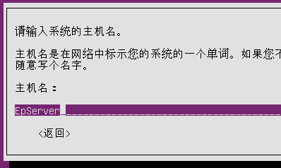

新用户的全名和主机名一样，输入完毕后按回车

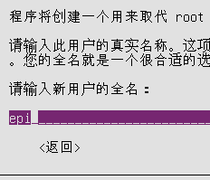

接着输入登录时的用户名，完成后回车

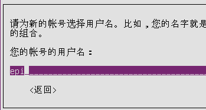

密码这个仍然是跟着感觉走，输入完毕后回车，验证一遍，回车

如果你的密码比较短，会弹窗提示密码较弱，点 `是` 使用弱密码

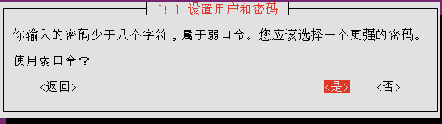

接着会问你要不要加密主目录，这个点否就行，因为这个是自己电脑上使用的，和安全没关系

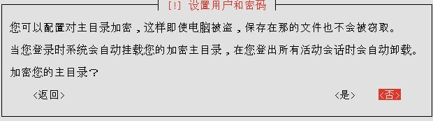

接下来会从服务器设置时间，之后会弹窗问你是不是在提示上的时区里，只要是在中国区域内任一城市就可以点 `是` 了

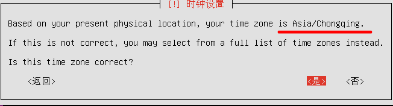

接着安装程序会检测磁盘，等待探测磁盘结束，会问你如何使用磁盘，选择第二个，按回车

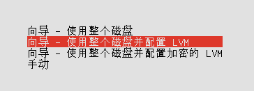

再按一次回车，因为我们只有一个分区

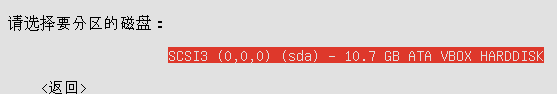

选 是 来确认分区方案并进行写入

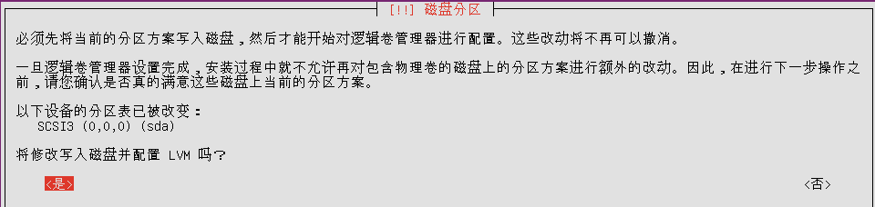

接着会问你主分区要用多大的空间，图上是默认全部分配，回车就好了，因为我们用不到那么多分区

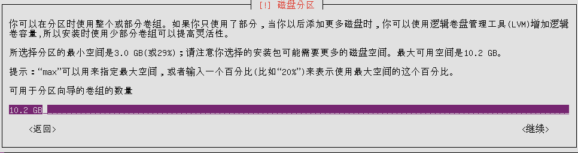

你可能会疑问这里为什么设置的是 10G 的虚拟磁盘画面上是 10.2G，1024 和 1000 进制的问题嘛，买个 U 盘的坑，大家都懂的

接下来会问你要不要强制 UEFI 安装，选择 `是` 就好了

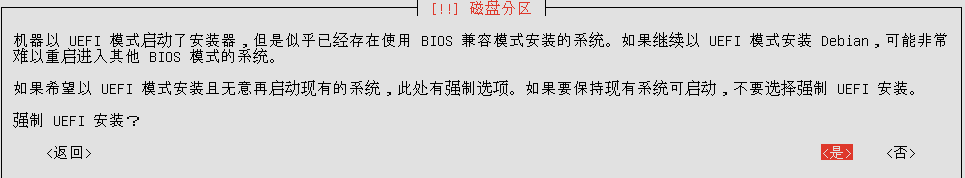

这时候会让你确认分区情况，确认之后就开始安装了

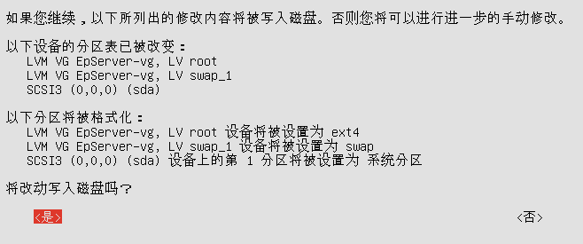

以上所有图仅作为例子，每个人的配置不是非得一样的

这时候，安装程序开始读条，大概过个几分钟，会弹窗问你 http 代理的信息，直接回车或者按下 Tab 键使光标高亮到 继续 后回车

当然，如果你有更科学的手段，可以填上去

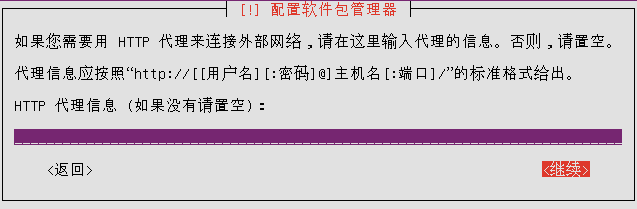

接着程序会下载文件配置 apt 包管理器，没有配置代理的话这一步会非常久，请耐心等待

下载完成之后，自动读条，会问你应用更新那些事，选择`没有自动更新`就行了，之后我们可以手动用包管理器更新，就好像你开电脑会用 QQ，但不会让它自动启动一样

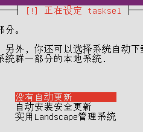

继续读条，到软件选择的时候，按下键盘 Tab 键，点继续就行了，别的不理会

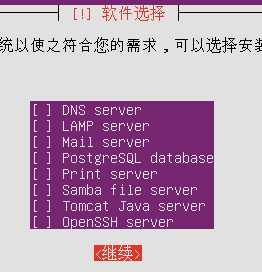

然后就开始安装 Ubuntu 的全家桶了 hhhhh

在结束安装进程弹出后，在虚拟机的右下角有个光盘图标，点击之后移除光盘(默认是最下面)


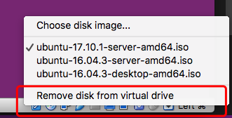

移除之后按下回车，过了一会便会重启了

安装 (不含之前的配置步骤) 会经过以下过程：

* 正在安装系统
* 正在配置 apt
  * 设置代理
* 选择并安装软件
  * 正在设定 tasksel
  * 软件选择
* 安装 GRUB 启动引导器
* 正在结束安装进程
  * 取出安装介质

你可以用这个列表来确认自己的安装进度

## 配置 Ubuntu

### 登陆

重启之后，启动完成会让你登陆，这个填安装时的你输入的用户名和密码

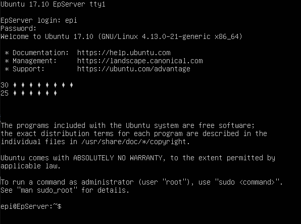

图片上的菱形是中文字符，在这个窗口里没法显示而已

### 配置镜像地址

和桌面版的 Ubuntu 一样，由于中国网络比较魔法的原因，我们不能让它从国外服务器下软件包

这里推荐使用中科大的镜像

```bash
$ sudo nano /etc/apt/source.list
```

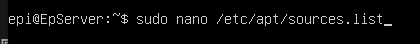

执行之后会让你输入用户密码，验证后就会开始编辑 source.list 文件了，把文件上的 `http://cn.archive.ubuntu.com/ubuntu` 这样的链接，把 `cn.archive.ubuntu.com` 部分更改为

```
mirrors.ustc.edu.cn
```

图上作为参考

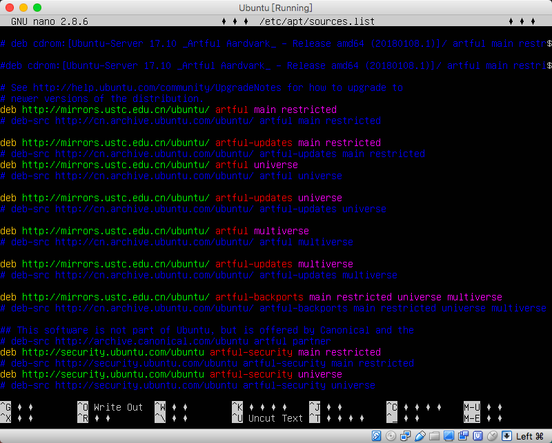

大概需要改 7 行，security 的部分就不要碰了，其中我删掉了几行注释，只是为了方便你们查看应该修改哪些地方。nano 的操作就是用光标进行移动，和记事本一样

编辑结束后确认一下没有拼错的地方，按下 ctrl + o (Mac 上是 control) 键之后回车进行保存。之后按下 ctrl + x 退出，以看到用户名@主机名为退出标志

当然，编译源列表文件如果你更熟悉 vim 的话可以使用 vim，记得带上 sudo

### 安装 openssh

这一步是为了在宿主机上用命令行来使用虚拟机做的工作

首先敲：

```bash
$ sudo apt-get update
```

更新一下源

结束之后，更新一下原有的包

```bash
$ sudo apt-get upgrade
```

出现一个 [Y/n] 的时候，输入大写 Y 后敲回车，菱形仍然是因为中文

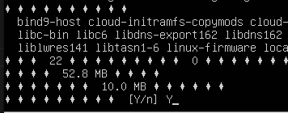

之后就会自动更新了，会需要几分钟的时间

接着敲 sshd 来查看 openssh 的安装方法

```bash
$ sshd
```

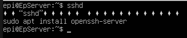

根据图中的提示：

```bash
$ sudo apt install openssh-server
```

再次用 Y 来确认安装

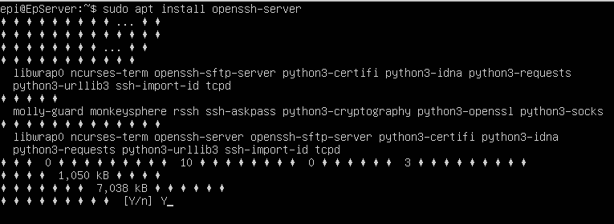

安装结束后，可以关机了

```bash
$ sudo shutdown now
```

会显示一排绿色的 OK

## 设置端口转发

虚拟机的设置 -> 网络 -> 网卡 1 -> 高级 -> 端口转发

点击右边的添加按钮，服务器的 ssh 端口是 22，我们只要将本地其中一个端口映射到虚拟机的 22 端口就可以了

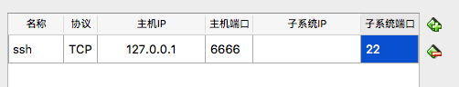

图上的 ssh 是名字，6666 是本地映射到虚拟机的端口，这两个你可以跟着感觉走

端口号是一个无符号的 int，从 81 到 65535 都可以

设置完成后，两次确定，保存

## 用 ssh 登陆

首先启动虚拟机，但是这一次启动方式是“无界面启动”

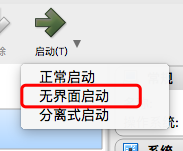

之后等待大约半分钟的启动用时，就可以用本地终端来登陆机子了

```bash
$ ssh epi@127.0.0.1 -p 6666
```

其中 epi 是你的用户名，6666 是我们设置的转发端口

第一次连接会问你是否继续连接，输入 yes 后回车

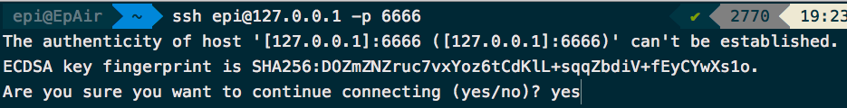

之后输入你的密码，登陆就成功了

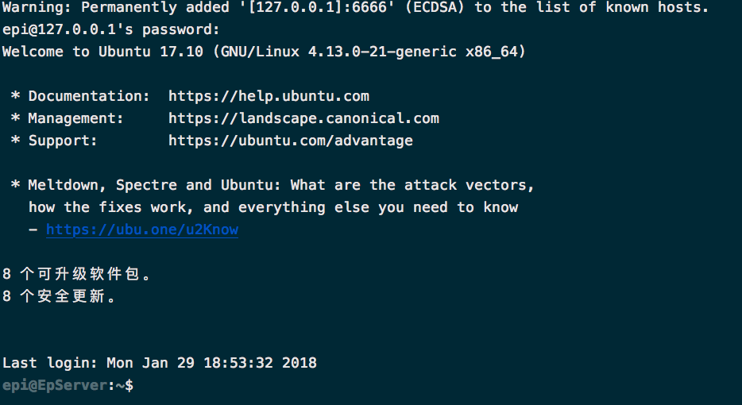

中文也都正常显示了

## 后记

### 我是 Win 平台该怎么登陆？

下载一个 git，用 git bash 登陆就可以了，命令都是一样的

### 命令行的关机？

执行 shutdown 命令就可以

### 127.0.0.1 太麻烦了

你可以配置 `~/.ssh/config` 文件来方便自己

```bash
$ nano ~/.ssh/config
```

然后写下接下来这些东西

```
Host EpUbuntu
  Hostname 127.0.0.1
  Port 6666
  User epi
  Compression no
  PreferredAuthentications password
```

其中 Host 就是你服务器的名字，Hostname 是地址，Port 为端口号，填的是你转发端口设置的东西，User 为你的用户名，Compression 照抄，PreferredAuthentications 就用密码 `password`，如果你更改了虚拟机上的 sshd_config 的话可以考虑用密钥链接

这样你就可以使用 `ssh EpUbuntu` 这样简短的命令来连接了

如果你还想更简便

```bash
$ alias CONNECT='ssh EpUbuntu'
```

把这句写进 .bashrc .zshrc 等文件里
