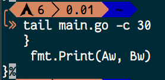
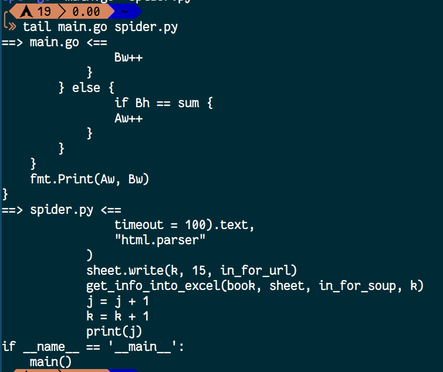
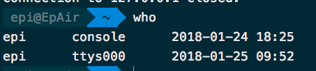

# Linux 命令 - 初阶

其实把 Linux 的入门学了之后，现在你应该会使用 --help 和 man 来查看每个命令的每个选项怎么使用了

接下来讲的是较常用的一些选项

## tail - 大文本的查看末尾

有时候一个文本打开时候很大，但你又不想像 cat 那个样子全部阅读，我只需要**末尾的那几行**或者**末尾的那几个字符**，就要用到 tail 命令

假定我们现在有一段代码，文件名字叫做 main.go，内容是这样的

```go
package main

import "fmt"

func main() {
    var Time, A, Ah, B, Bh int
    var Aw, Bw int
    Aw = 0
    Bw = 0
    fmt.Scanf("%d\n", &Time)
    for i := 0; i < Time; i++ {
        fmt.Scanf("%d %d %d %d\n", &A, &Ah, &B, &Bh)
        sum := A + B
        if Ah == sum {
            if Bh == sum {
                continue
            } else {
                Bw++
            }
        } else {
                if Bh == sum {
                Aw++
            }
        }
    }
    fmt.Print(Aw, Bw)
}
```

我们要查看它的后面五行，命令为

```shell
$ tail -n 5 main.go
```

相当于

```shell
$ tail --line 5 main.go
```

```shell
$ tail main.go    #这是默认末尾十行
```


如果是后面的 30 个字符，命令为

```shell
$ tail -c 30 main.go
```



你也可以同时查看多个文件的末尾，例如

```shell
$ tail main.go spider.py
```



它会默认显示十行并根据你的参数顺序来打印每个文件，加上文件名字

如果你不想显示这个文件名字：

```shell
$ tail --quiet main.go spider.py
```

## head - 查看大文本的开头

用法基本和 tail 一样，不过如果你在 mac 平台里选项只有 -n 和 -c

你也可以安装了 coreutils 之后用 ghead, gtail 等 GNU 的工具

## which - 查看命令程序的位置

上一章讲环境变量的时候就提到过了，如果你想在当前目录下执行其他目录下的程序，要么加上路径，要么添加环境变量。如果你添加了环境变量，可以直接使用某个程序，那你想看到它具体在文件系统的哪个位置的时候：

```shell
$ which <command>
```

例如：

```shell
$ which ls      # 查看 ls 命令的位置
$ which sudo    # 查看 sudo 命令的位置
```

但是如果我们想看一下 cd 的位置的时候，输出结果是这样的

```shell
cd: shell built-in command
```

这是因为 cd 是 bash 它自身的命令，而不是一个具体的程序

## type - 查看命令类型

which 是用来查看命令存放位置的，type 是用来显示类型和位置的

```shell
$ type ls
```


这是一个别名

```shell
$ type cd
```


这是一个 shell 命令

```shell
$ type sudo
```


这是一个程序


## w - 谁登陆了并且在做什么

服务器是需要登录使用的嘛，哪怕在物理机上直接用也是需要登录的对不对。但是协同工作的需要，一台机子不只是像 Windows 那样只能一个人在用，很多人可以同时登录这台机子。这时候就可以查看有多少人登录了这台机子

```shell
$ w
```

给一个输出样例

```
21:20:02 up 20 min,  2 users,  load average: 0.00, 0.00, 0.00
USER     TTY        LOGIN@   IDLE   JCPU   PCPU WHAT
epi      tty1      21:19    3.00s  0.02s  0.02s -zsh
epi      pts/0     20:59    0.00s  0.10s  0.00s w
```

此图上的 USER 就是用户名了；TTY 指的是你登录的终端类型；LOGIN@ 是登录的时间；IDLE 为用户的空闲时间，指的是显示这个信息到上一次你输入命令的间隔；JCPU 指的是和该终端连接的所有进程占用时间，包括前台和后台；WHAT 是当前它在做什么事情

一些参数说明

```shell
$ w -h
$ w --no-header     # 不打印 USER、TTY 等标题

$ w -o
$ w --old-style     # 旧式输出风格

$ w -V
$ w --version       # w 命令的当前版本

$ w -s
$ w --short         # 简化输出的内容

$ w -i
$ w --ip-addr       # 显示登陆者的 IP 地址(如果可以)

$ w -f
$ w --from          # 显示登陆者的机子名称
```

## >> - 追加

在入门的时候我们说过 `>` 是将输出重定向到文件的，也就是将输出写入。但是这个操作是会覆盖原来的内容的，意思是原来文件里有内容的话，这个操作就会把原来的内容删掉后写入新的内容

如果是往文件末尾追加，就可以用 `>>`

```shell
$ echo "Hello World" >> 1.txt
```

## ping - 测试网络延迟

ping 这个词我们都不少见了，偶尔在 win 上我们也会用它来测试是否联网

在 bash 下面的 ping 和 Win 下的不太一样，Win 默认 ping 4 次，bash 会一直 ping

```shell
$ ping <url>
```

一直 ping url 指示的服务器，你可以用 Ctrl + C (Mac 上是 Control + C) 来终止 ping 并统计 ping 的结果

你也可以指定次数

```shell
$ ping -c <count> <url>
```

-c 之后是次数


你也可以指定发送每个 ping packet 的时间间隔

```shell
$ ping -i <wait> so.com
```

-i 选项之后的数字时间单位是秒

测试联网的时候，你还可以加上一个 -o 的选项

```shell
$ ping -o so.com
```

一直发送 ping packet，只要收到一个回复就正确退出

不显示每个 packet 的结果，单纯显示结果

```shell
$ ping -q so.com
```

其中的 -q 意思是 quiet

你还可以指定发送的 packet 大小

```shell
$ ping -s <packetsize> so.com
```

不指定的情况下默认是 56

## who - 简化版的 w

who 和 w 的区别是，who 只显示谁登陆了

```shell
$ who
```



第一列是用户名，第二列是登陆设备 (Console, tty)，第三列是登陆时间

## read - 读取文字到变量

默认读取一行，把它交给特定变量 REPLY：

```shell
$ read
```

你可以用 echo 来查看结果

```shell
$ echo $REPLY
```

读取并交给指定变量：

```shell
$ read Hello
```

意思是将读取到的东西交给 Hello

像密码一样，输入的时候不回显，使用 -s 选项：

```shell
$ read -s
```

如果你是 Mac，还会给一个钥匙的图标


## df - 显示磁盘剩余空间

直接查看，默认以字节为单位：

```shell
$ df
```

输出的 Sized 为总容量，Used 是已用，Avail 为可用空间，Capacity 是已用的百分比，Filesystem 为文件系统，第一个默认是本地的硬盘，Mounted on 为挂载的位置

以增加可读性的单位显示剩余空间：

```shell
$ df -h
```

如果是大写的 H，单位是以 1000 进制计算

## du - 统计磁盘使用数据

```shell
$ du
```

默认显示当前位置下的每一个文件夹的使用情况，如果当前文件夹还有文件夹，也一块输出

每一行输出有两个部分，前面是占空间大小，后面是路径

带单位的占用大小：

```shell
$ du -h
```

## less - 灵活的查看文本

某些文本是很大的，cat 又不太方便，所以我们可以用 less

```shell
$ less 1.c
```

接着会进入到 man 那样操作的界面 (其实 man 的查看就是用的 less)，你还可以用鼠标滚轮来快速翻页

## sleep - 等待一段时间

```shell
$ sleep <seconds>
```

\<seconds\> 的单位是秒，通常会在 shell 脚本里配合使用


## 未完待续……