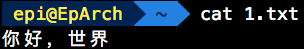
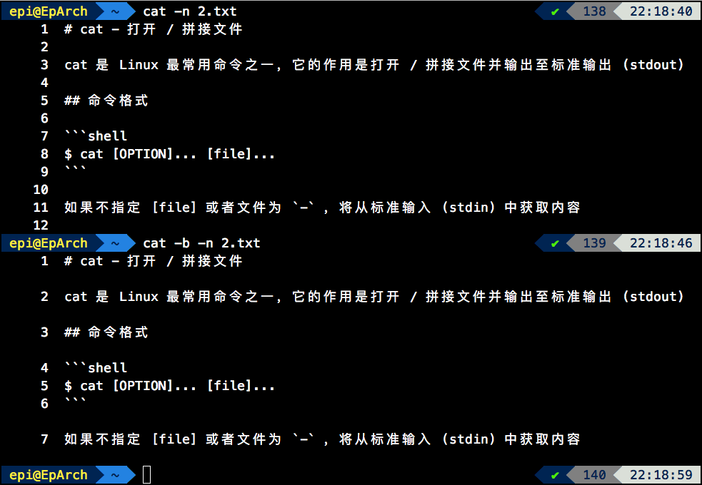
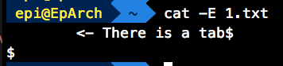
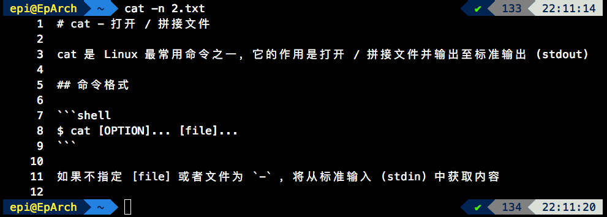
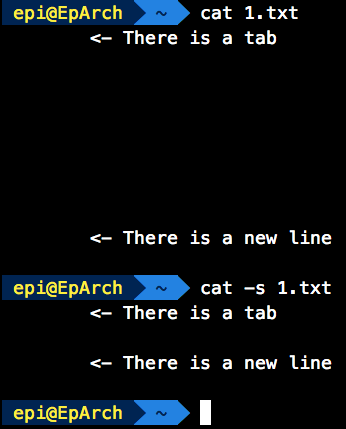
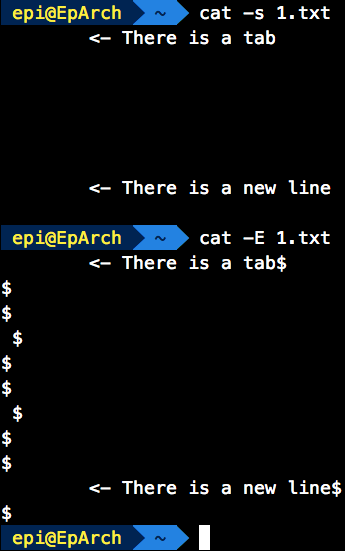
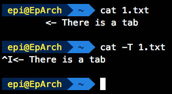
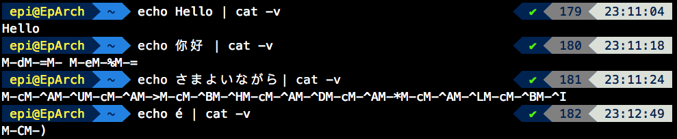
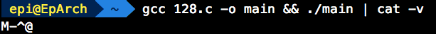

# cat - 打开 / 拼接文件

cat 是 Linux 最常用命令之一，它的作用是打开 / 拼接文件并输出至标准输出 (stdout)

## 命令格式

```shell
$ cat [OPTION]... [file]...
```

如：

```shell
$ cat 1.txt
```

输出 1.txt 的内容



```shell
$ cat 1.txt 2.txt
```

先输出 1.txt 的内容，紧跟着输出 2.txt 的内容，命令的文件顺序决定着输出顺序

```shell
$ cat
```

从标准输入 (stdin) 中获取内容并输出

如果不指定 [file] 或者文件为 `-` ，将从标准输入 (stdin) 中获取内容，比如 `$ cat` 等价于 `$ cat -`

cat 的选项有 -A, -b, -e, -E, -n, -s, -t, -T, -u, -v, --help 和 --version，接下来将逐一讲解选项

## -A

-A 选项等价于 `-vET`，或 `-v -E -T`

## -b

显示非空内容行的行号，当 `-b` 选项存在时，`-n` 选项无效



## -e

`-e` 选项等价于 `-vE`，或 `-v -E`

## -E

`-E` 选项等价于 `--show-ends`

在每一行的末尾显示一个 $ 符号



## -n

`-n` 选项等价于 `--number`

输出内容时在左边显示行号



## -s

`-s` 选项等价于 `--squeeze-blank`

`-s` 选项的作用是，将一行以上 (不包括一行) 的空行，压缩成一行



这里的空行是指，纯空行。如果有制表符 (Tab) 或者空格符不算空行



## -t

等价于 `-vT` 或者 `-v -T`

### -T / --show-tabs

`-T` 选项等价于 `--show-tabs`

输出的时候将制表符 (Tab) 转换成 `^I`



## -u

该选项无详细解释

## -v

`-v` 选项等价于 `-show-nonprinting`

原文是 "use ^ and M- notation, except for LFD and TAB"。在经历过一番测试之后，得出结论：`-v` 选项是纯 ASCII 输出，把除了换行符 (LFD, linefeed) 和制表符 (TAB) 以外的 ASCII 码大于 127 的用 M- 助记符表示 (类似转义字符，Unicode 的表示方法)



至于如何得出是 0 ~ 127 范围内的 ASCII 呢，我写了一段 C 来验证这个范围：

```c
#include <stdio.h>
int main()
{
    unsigned char c = 128;
    printf("%c\n", c);
    return 0;
}
```

```shell
$ gcc 128.c -o main && ./main | cat -v
```



由图可知，ASCII 码大于 127 的就会用助记符输出

而 ^，经过实验，大概是某些本来不显示的字符，会用上 ^ 助记符，如 \a \b \0 等字符


## --help

此选项用于显示使用帮助

```shell
$ cat --help
Usage: cat [OPTION]... [FILE]...
Concatenate FILE(s) to standard output.

With no FILE, or when FILE is -, read standard input.

  -A, --show-all           equivalent to -vET
  -b, --number-nonblank    number nonempty output lines, overrides -n
  -e                       equivalent to -vE
  -E, --show-ends          display $ at end of each line
  -n, --number             number all output lines
  -s, --squeeze-blank      suppress repeated empty output lines
  -t                       equivalent to -vT
  -T, --show-tabs          display TAB characters as ^I
  -u                       (ignored)
  -v, --show-nonprinting   use ^ and M- notation, except for LFD and TAB
      --help     display this help and exit
      --version  output version information and exit

Examples:
  cat f - g  Output f's contents, then standard input, then g's contents.
  cat        Copy standard input to standard output.

GNU coreutils online help: <https://www.gnu.org/software/coreutils/>
Full documentation at: <https://www.gnu.org/software/coreutils/cat>
or available locally via: info '(coreutils) cat invocation'
```

当 `--help` 选项存在时，即便指定了文件，也不会输出，只输出帮助信息

## --version

打印当前 cat 版本

`--version` 选项存在时，和 `--help` 一样，即便指定了文件，也不会输出，只输出版本信息
