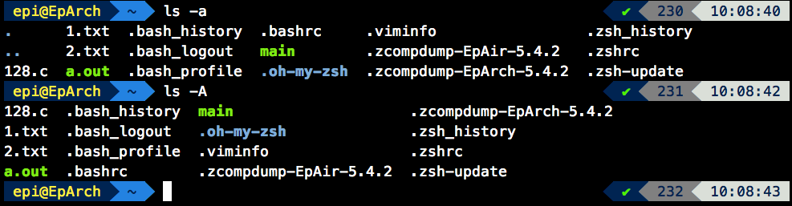
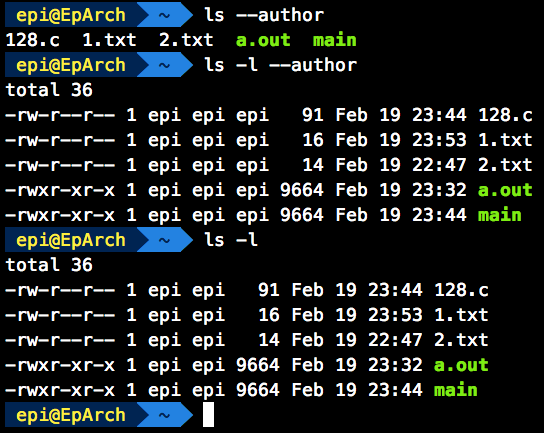
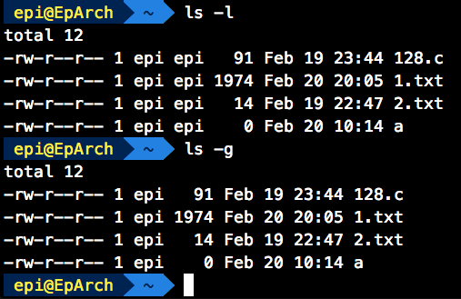
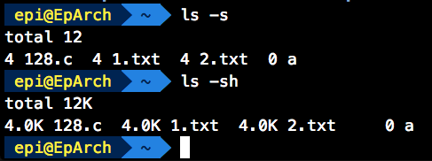
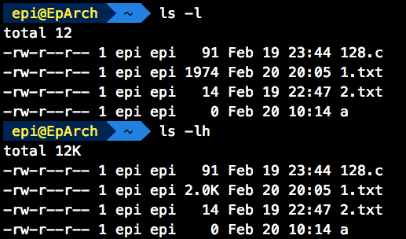
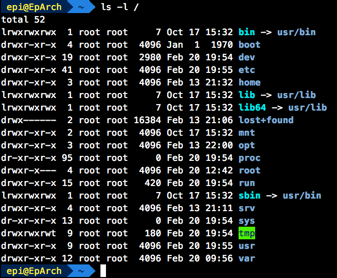

# ls - 列出目录的内容

ls 同样是很基本的操作，它的作用是将指定目录下的内容列出来，和 win 下的 dir 命令相似，不过 ls 更强大

首先来看一下 ls 的命令格式：

```shell
$ ls [OPTION]... [FILE]...
```

在 [FILE] 未指定的情况下，默认为当前目录 (.)，若已指定则为指定的目录

```shell
$ ls
$ ls .  # 两者等价，展示当前工作目录下非 . 开头的文件
```

ls 的 [OPTION] 有很多，接下来逐一讲解各个 [OPTION] 的功能

## -a, --all

`-a` 的作用是不忽略以 . 开始的文件 / 文件夹。在 Unix 里，隐藏的文件 / 文件夹以 . 开始。比如 .bashrc 等，还有两个最常见的，. 和 ..

## -A, --almost-all

和 `-a` 类似，不过不会把 . 和 .. 给显示出来



## --author

在 `-l` 存在的情况下，将每个文件的作者显示出来



至于每一列是什么意思，在 `-l` 处会讲到

## -F, --classify, --indicator-style=classify

在特定条目末尾增加指示符 (*/=>@| 的其中一个)

| 符号 | 含义 |
|-----|-----|
| * | 可执行文件 |
| / | 目录 |
| @ | 链接 |
| = | 数据接口文件 (sockets) |
| > | 门文件 (door) |
| \| | 数据输送文件 (FIFO) |

## --file-type

与 `-F` 相似，不过不会在可执行文件后面带 *

## -g

和 `-l` 相似，不过不显示所有者



## -h, --human-readable

在 `-l` 或者 `-s` 选项启用时，文件大小用方便阅读的单位





## --si

与 `-h` 相同，但是进制为 1000 而不是 1024

## -l

在 `-l` 选项启用时，使用长列表格式展示目录下的文件

```shell
$ ls -l /    # / 为根目录，此命令为使用长列表格式展示根目录的文件
```



---

未完待续……
