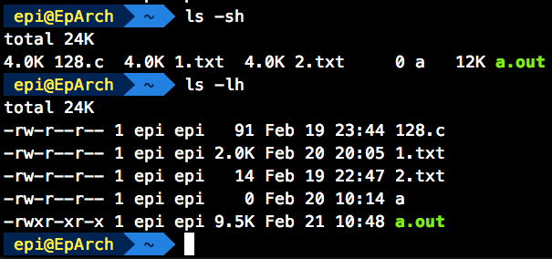

# ls - 列出目录的内容

ls 同样是很基本的操作，它的作用是将指定目录下的内容列出来，和 win 下的 dir 命令相似，不过 ls 更强大

首先来看一下 ls 的命令格式：

```shell
$ ls [OPTION]... [FILE]...
```

在 [FILE] 未指定的情况下，默认为当前目录 (.)，若已指定则为指定的目录

```shell
$ ls
$ ls .  # 两者等价，展示当前工作目录下非 . 开头的文件
```

ls 的 [OPTION] 有很多，接下来逐一讲解各个 [OPTION] 的功能

## -a, --all

`-a` 的作用是不忽略以 . 开始的文件 / 文件夹。在 Unix 里，隐藏的文件 / 文件夹以 . 开始。比如 .bashrc 等，还有两个最常见的，. 和 ..

## -A, --almost-all

和 `-a` 类似，不过不会把 . 和 .. 给显示出来


## --author

在 `-l` 存在的情况下，将每个文件的作者显示出来


至于每一列是什么意思，在 `-l` 处会讲到

## --block-size=SIZE

在 `-l` 启用时，文件大小使用 SIZE 指定的比例

```shell
$ ls -l --block-size=M
```

这时的单位就是 M

SIZE 的格式如下：

**[integer][unit]**

其中 [integer] 为一个整数，[unit] 则为单位

单位有：K, M, G, T, P, E, Z, Y (1024 进制)，KB, MB... (1000 进制)

eg: --block-size=10M (10 * 1024)

## -B, --ignore-backups

不显示以 ~ 结尾的条目

## -d, --directory

列出目录自身，而不是内容

## -f

禁用默认开启的排序，并开启 `-aU`，禁用 `-ls` `--color`

## -F, --classify, --indicator-style=classify

在特定条目末尾增加指示符 (*/=>@| 的其中一个)

| 符号 | 含义 |
|-----|-----|
| * | 可执行文件 |
| / | 目录 |
| @ | 链接 |
| = | 数据接口文件 (sockets) |
| > | 门文件 (door) |
| \| | 数据输送文件 (FIFO) |

## --file-type

与 `-F` 相似，不过不会在可执行文件后面带 *

## --full-time

`-l` 选项存在时完整的修改日期

## -g

和 `-l` 相似，不过不显示所有者


## -h, --human-readable

在 `-l` 或者 `-s` 选项启用时，文件大小用方便阅读的单位


## --si

与 `-h` 相同，但是进制为 1000 而不是 1024

## -k, --kibibytes

默认簇大小为 1024 Byte，只与 `-s` 选项一同使用


## -l

在 `-l` 选项启用时，使用长列表格式展示目录下的文件

```shell
$ ls -l /    # / 为根目录，此命令为使用长列表格式展示根目录的文件
```


就拿图上的 etc/ 来说吧

<u>drwxr-xr-x 41 root root  4096 Feb 21 09:19 etc</u>

第一列的 drwxr-xr-x，第一个字母代表着这个条目的类型，d 代表着它是一个目录 (directory)

| 字母 | 类型 |
|-----|-----|
| \- | 普通文件 |
| d | 文件夹 |
| l | 链接 |
| b | 块文件 |
| c | 字符设备文件 |
| s | 套接字文件 |
| p | 管道文件 |


接着到 rwx r-x r-x，第一个 (rwx) 是所有者的权限，r 代表读，w 代表写，x 代表执行。第二个 (r-x) 是用户组的权限，第三个 (r-x) 是其他用户的权限

接着到了 41。如果这一条目是文件夹，这一列数字代表着**第一级子目录数**；如果是普通文件，则为**链接数**

后面的两列 root，第一列表示用户名，第二列代表着组 (Group) 名

4096 为文件 / 文件夹大小

Feb 21 09:19 为**最后修改日期**

## -n, --numeric-uid-gid

和 `-l` 类似，但是在用户名和用户组用的是数字 ID

## -o

和 `-l` 类似，但不显示用户组

## -q, --hide-control-chars

使用 ? 替代无法显示的字符

## -R, --recursive

递归的列出子目录

慎用！因为这个选项可能会导致 ls 很长一段时间处于输出的状态，除非你已经知道那个目录的内容

## -s, --size

打印每个文件的占用大小



`-l` 选项是文件的实际大小，`-s` 为占用大小

文件的大小其实就是文件内容实际具有的字节数，它以Byte为衡量单位，只要文件内容和格式不发生变化，文件大小就不会发生变化。但文件在磁盘上的所占空间却不是以Byte为衡量单位的，它最小的计量单位是“簇(Cluster)”

同一个文件在不同磁盘分区上所占的空间不一样大小，这是由于不同磁盘簇的大小不一样导致的。簇的大小主要由磁盘的分区格式和容量大小来决定，簇数 = 取整 (文件大小 / 簇大小) + 1 所占空间 = 簇数 × 磁盘簇大小， 公式中文件大小和簇大小应以 Byte 为单位，否则可能会产生误差。如果要以 KB 为单位，将字节数除以 1024 即可。利用上述的计算公式，就可以计算文件的实际占用空间

玩过 SSD 的应该都知道格式化要 4K 对齐，差不多就是占用空间的意思了

## -S

根须文件大小排序，大的优先

## -t

根据修改日期排序，最新修改的优先

## ls 退出状态

0，正常退出

1，小问题，比如无法访问子目录

2，严重问题，如无法读取命令行参数

---

未完待续……
