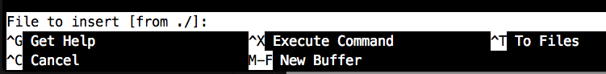

R= nano, 命令行下的可视化编辑器

编辑文本是什么系统都应该具备的功能，但是命令行系统没有图形化界面，没有窗口这些东西。
于是人们开发了一个基于命令行的可视化编辑器，它就是 nano

[source:shell]
----
$ nano
----

== 界面

打开这个界面的时候，你已经可以开始写东西了，白色的小块就是光标，移动它可以用上下左右方向键。

== 基础用法

图上的 ^ 符号代表着你键盘上的Ctrl 键 (Mac 为 control)

=== 打开文件：

[source:shell]
----
$ nano [filename]
----

也可以先打开 nano，再用 ^R 或者 F5 来选择文件

看到如下界面后，输入路径 + 名字就可以了，`from ./` 的意思是告诉你从当前文件夹，
你也可以输入完整路径

按回车确认你的输入

=== 保存文件

界面上有一个 Write Out，就是保存用的。如果你是指定文件名字打开的，^R 的时候会显示出来，
若不是，在 ^R 的时候要手动输入文件名字

同打开文件一样，按回车确认你的输入

=== 关闭

F2 或者 ^X，如果未保存，nano 会提示并让你确认

Yes 或者 No 按下键盘的字母就可以，无关大小写

== 进阶用法

=== 全文搜索

大文本避免不了进行搜索，在 nano 里的搜索是 ^W 键 (界面上的 Where Is)，之后输入你要搜索的内容，
回车之后会跳转到你光标所在位置的下一个搜索到的位置

假定有这么一段文本

[source::text]
----
Server = http://mirror.onet.pl/pub/mirrors/archlinux/$repo/os/$arch
## South Africa
Server = http://mirror.wbs.co.za/archlinux/$repo/os/$arch
## France
Server = http://archlinux.polymorf.fr/$repo/os/$arch
## Canada
Server = http://muug.ca/mirror/archlinux/$repo/os/$arch
## United States
Server = http://mirror.cs.pitt.edu/archlinux/$repo/os/$arch
----

假定你的光标在第二行的末尾，进行搜索 mirror 关键字的时候，会跳到第三行的那个 mirror

并且，如果你还想进行同关键字的第二次搜索，在 ^W 之后，直接按下回车就行了

打开搜索却不想搜索了(关闭搜索)的时候，按下 ^C，即是 cancel 的意思

是否在搜索的状态可以看界面下方是否有 Search 字样

=== Go To Line

难免会需要跳转到某一行，nano 里跳转的按键是 ^_ (界面上的 Go To Line)，下划线即键盘上的减号

输入两个数字，表示你要跳转的位置。第一个数字代表着行，第二个数字代表着列，
如 10 10 即 10 行 10 列。如果超出去了的话，默认会在末尾，比如哪一行没有 10 列，
就会跳到那一行的末尾

在等待输入的时候，快速跳转到第一行按 ^Y，最后一行按 ^V，并且会关闭输入

如果不是等待输入，^Y 是跳转到上一页，^V 是跳转到下一页，这里的页按一个屏幕计算

=== 显示当前位置

^C，接着界面下方会出现一行字，告诉你现在光标所在的位置

=== 插入文本

这个的意思是，当你在编辑某个东西的时候，再打开一个文件，将内容插入到光标所在的地方

很简单，只需要 ^R，输入文件名

=== 显示帮助

按下 F1 或者 ^G 都可以，再按一次关闭帮助

---

未完待续
