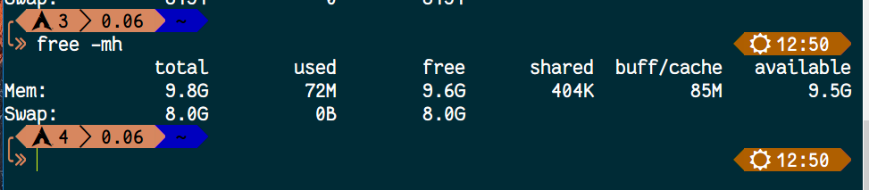
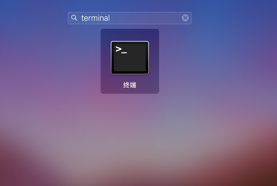
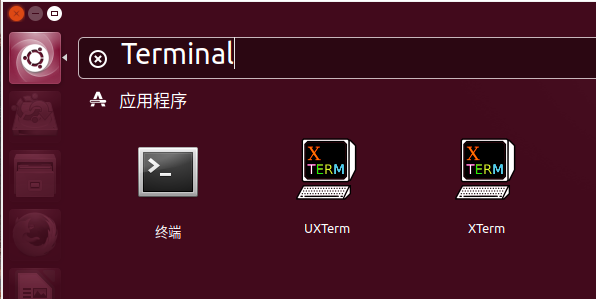
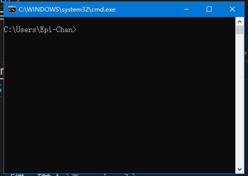

# 序言

## 什么是命令行

简要的来说，就是运行一类程序的环境。由于它的显示是一行一行的，所以我们把它叫做命令行

命令行程序运行的时候会出现一个黑黑的窗口(初学 C 语言和 Java、Python 等命令行程序的应该都有所体会)，这个叫做 `Shell`，它是负责和程序交互的。我们给程序输入东西的时候，会等待回车，然后Shell把你输入的内容和回车一起带给你的程序。程序输出东西的时候，把内容交给Shell，Shell会帮我们打印出来

Windows下的 `cmd` 是一种 Shell；最近微软搞了个非主流的东西，叫做 `PowerShell`，也是一种Shell；如果你另外安装了 `cmder` 啊 `ConEmu` 啊 `Git Bash` 啊，也是一种 Shell；Linux 下的 `Bash` 也是一种 Shell，等等等等。这些都是 Shell 的实例，就好比二哈、阿拉斯加、日天迪都是狗一样。本文旨在介绍一些命令和不同 Shell 之间的些许差别

## 命令行的起源

上世纪 70 年代的时候，那会还没有图形用户界面(GUI)，有的就是一个显示器，一个键盘，操纵电脑用的就是一行一行的命令。当时的系统是 Linux，所以命令行也是 Linux 比 Windows 更专业

后来GUI被开发出来后，人们的日常使用就变成了鼠标和界面，而不是比较专业的命令，命令留给了服务器等等领域

工程师可能不能随时守在服务器的旁边，但是如果要使用服务器，就必须用一个叫做 `ssh` 的程序来登录，远程执行命令。但为什么用 Linux 做服务器而不用 Windows 呢？首先，Linux 有 Minimal 版的系统，就是纯命令行，没有 GUI，这样减少了系统占用，尤其是内存。我们都知道现在 Win10 下 4G 内存平常使用都够呛，但是一个 Minimal 版的 Linux 的占用是多少？

我运行了一个没有图形界面的 Arch Linux，执行命令查看

```shell
$ free -mh
```

结果是：



只用了 72M，如果有图形呢？

我们在有界面的 Ubuntu 下执行相同的命令


结果相差了五百多 M，这个占用是很大的

作为服务器的话，没有 GUI 可以让这一部分资源用来运行其它的程序，使效率更高。而且现在的命令行程序运行速度都很快，比如 C、Go 语言写的程序等

## 我怎样能找到我自己电脑上的 Shell

### 如果你在 Windows

使用 `Windows + R` 键，即可调出一个叫做运行的窗口


然后输入 `cmd`，回车

或者，打开开始菜单，搜索框里输入 cmd，找到命令提示符


### 如果你在Mac OS

从桌面上进去 Launch Pad


找到终端，打开它



### 如果你是 Linux

#### 如果你有 GUI

Ubuntu 下点击左上角的 Ubuntu 标志，搜索 Terminal，打开终端



CentOS 等等也基本类似

#### 如果你没有 GUI

那就直接是命令行

## 命令行界面的组成部分



### 路径


红线部分就是路径，意思是这个命令窗口当前所在的位置

比如说，我们要运行某一个程序，如果不用快捷方式的话，就得过去他所在的那个文件夹，双击运行，对不对？那么命令行也是同理的

### 光标

和记事本、Word 一样，光标所在的区域是让你输入命令的
