# Terminal Tutorial #

本文旨在介绍终端，命令行，以及常用命令

## 什么是命令行 ##

简要的来说，就是运行一类程序的环境。由于它的显示是一行一行的，所以我们把它叫做命令行<br>
命令行程序运行的时候会出现一个黑黑的窗口(初学C语言和Java、Python等命令行程序的应该都有所体会)，这个叫做`Shell`，它是负责和程序交互的。我们给程序输入东西的时候，会等待回车，然后Shell把你输入的内容和回车一起带给你的程序。程序输出东西的时候，把内容交给Shell，Shell会帮我们打印出来<br>
Windows下的`cmd`是一种Shell；最近微软搞了个非主流的东西，叫做`PowerShell`，也是一种Shell；如果你另外安装了`cmder`啊`ConEmu`啊`Git Bash`啊，也是一种Shell；Linux下的`Bash`也是一种Shell，等等等等。这些都是Shell的实例，就好比二哈、阿拉斯加、日天迪都是狗一样。本文旨在介绍一些命令和不同Shell之间的些许差别

## 命令行的起源 ##
上世纪70年代的时候，那会还没有图形用户界面(GUI)，有的就是一个显示器，一个键盘，操纵电脑用的就是一行一行的命令。当时的系统是Linux，所以命令行也是Linux比Windows更专业<br>
后来GUI被开发出来后，人们的日常使用就变成了鼠标和界面，而不是比较专业的命令，命令留给了服务器等等领域<br>
工程师可能不能随时守在服务器的旁边，但是如果要使用服务器，就必须用一个叫做`ssh`的程序来登录，远程执行命令。但为什么用Linux做服务器而不用Windows呢？首先，Linux有Minimal版的系统，就是纯命令行，没有GUI，这样减少了系统占用，尤其是内存。我们都知道现在Win10下4G内存平常使用都够呛，但是一个Minimal版的Linux的占用是多少？<br>
我运行了一个没有图形界面的Arch Linux，执行命令查看
```shell
$ free -mh  # 前面的$号叫做prompt，提示你在一个REPL环境下，如果是root用户会变成#，cmd下是>，Mac和Windows下的 cmd无此命令
```
结果是：<br>
<br>
只用了72M，如果有图形呢？<br>
我们在有界面的Ubuntu下执行相同的命令<br>
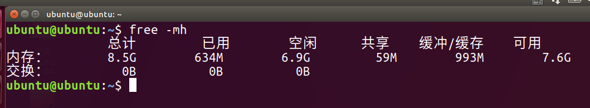<br>
结果相差了五百多M，这个占用是很大的<br>
作为服务器的话，没有GUI可以让这一部分资源用来运行其它的程序，使效率更高。而且现在的命令行程序运行速度都很快，比如C、Go语言写的程序等

## 我怎样能找到我自己电脑上的Shell？ ##

### 如果你在Windows ###

使用 `Windows + R` 键，即可调出一个叫做运行的窗口<br>
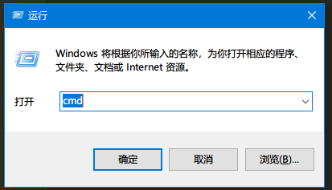<br>
然后输入`cmd`，回车<br>
或者，打开开始菜单，搜索框里输入cmd，找到命令提示符<br>
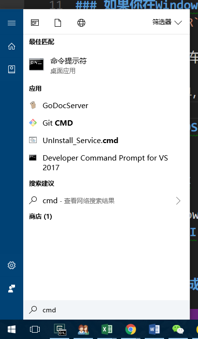<br>

### 如果你在Mac OS ###
从桌面上进去Launch Pad<br>
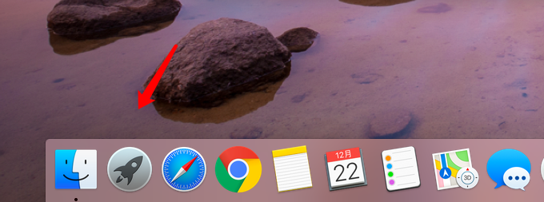<br>
找到终端，打开它<br>


### 如果你是Linux ###

#### 如果你有GUI ####

Ubuntu下点击左上角的Ubuntu标志，搜索Terminal，打开终端<br>
<br>
CentOS等等也基本类似

#### 如果你没有GUI

那就直接是命令行

## 命令行界面的组成部分 ##

### 路径 ###
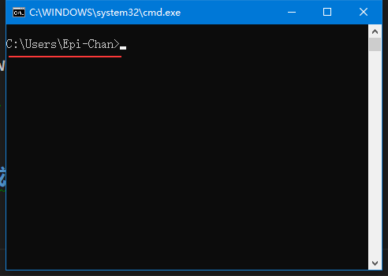<br>
红线部分就是路径，意思是这个命令窗口当前所在的位置<br>
比如说，我们要运行某一个程序，如果不用快捷方式的话，就得过去他所在的那个文件夹，双击运行，对不对？那么命令行也是同理的

### 光标
和记事本、Word一样，光标所在的区域是让你输入命令的

## 我们用几个命令来入门CMD ##
其它系统平台请略过，往后看
### 第一个命令
``` batch
> echo 你好，命令行
```
上方的阴影区域就是我们要输入进去的命令，其中由三个部分组成<br>
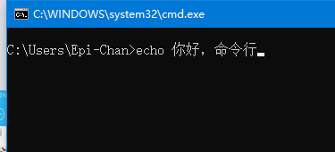<br>
`>`是prompt，默认存在，所以我们只需要输入`echo 你好，命令行`<br>
`echo`是我们要运行的程序，中间有一个空格，`你好，命令行`是我们给它的参数<br>
参数的意思是，我在程序启动的时候给了它一些东西，它会把这个东西拿去使用，比如在C语言里，我们读进一个数然后再输出，参数实际上是运行前就给它了<br>
敲完之后我们敲`回车`<br>
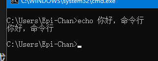<br>
然后屏幕上出来了`你好，命令行`，这个是`程序的输出`<br>
你也可以<br>
``` batch
> echo "Hello World"
```
在命令行程序里，给定参数的时候，如果参数中间有空格，用双引号把它包起来<br>


### 列出当前目录的东西 - dir
```batch
> dir
```
这个命令是列出当前路径下的所有`文件`和`文件夹`<br>
<br>
每一行中标了`<dir>`的为文件夹(diretory)

### 新建一个文件夹 - mkdir
``` batch
> mkdir epi   rem 意思是在当前目录新建一个叫做epi的文件夹
```
这个命令是用来新建文件夹的，我们可以用`dir`来看创建的结果
<br>
`epi`只是我用来做实验的，当然你们可以自己起名字<br>
上图中我用`管理员权限`打开的，因为在C盘某些文件夹下新建文件夹等操作会涉及权限问题

### 删除文件 - del
```batch
> del xxx.jpg
```
这样，就可以删掉那个叫做`xxx.jpg`的图像文件了<br>
你可以使用`dir`来查看删除的结果

### Goto Anywhere - cd
既然涉及了路径，有的时候我们要去别的路径下，那么要使用`cd`命令，带我们过去
```batch
> cd epi
```
意思是进入一个叫做`epi`的文件夹<br>
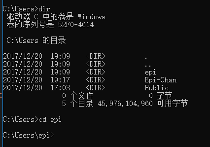<br>
这时候我们就会看到，路径变了<br>
如果我们有一个文件夹的名字是`带了空格`的呢？那就加上双引号<br>
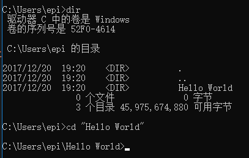<br>
回到上一个文件夹怎么办呢？
```batch
> cd ..
```
`cd`加上一个空格再写两个`.`<br>
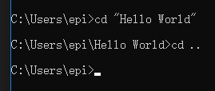<br>
记得参数之间是有空格的<br>
如果你不想一直敲cd进入某个文件夹，你想一次进入，可以把地址复制下来<br>
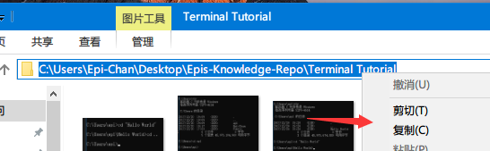<br>
```batch
> cd [你所复制的内容]
```
然后就会快速的过去了<br>
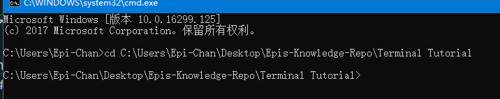<br>
我们的电脑硬盘一般都有几个分区，如果要切换，就敲那个`盘符`+`半角冒号`，如：
```batch
> D:  
```
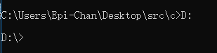<br>
这样就会去到D盘了<br>
操作上述那个复制路径的命令的前提是，盘符相同。如果不相同，先换所在分区再操作

### 运行目录下面的程序
假定我们现在有一个叫做`Hello.exe`的用C语言说Hello的程序，就在我们所在的目录下<br>
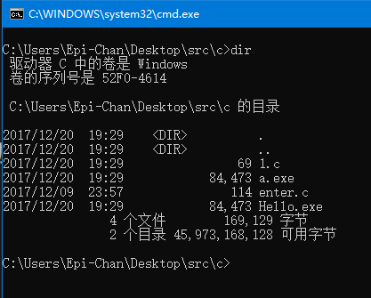<br>
直接敲名字即可运行(也可以带上那个`.exe`)
```batch
> Hello
```
<br>
然后你会发现，不用加上`system("pause")`也不会闪退

### 清空屏幕上的文字 - cls
命令敲多了，命令窗口总会有一堆文字，我们需要清屏命令来清除它<br>
* Before<br>


```batch
> cls
```

* After<br>

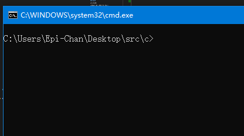<br>

### 打开某一个文本文件 - more ###

`more`命令会把参数所表示的文件的内容输出到屏幕上

```batch
> more 1.c
```

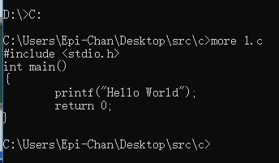

### 快速补全 ###

我们都知道，如果某一个命令又臭又长，敲起来会很难受<br>
假定我们还是那个`Hello World`文件夹<br>
<br>
`cd`时候敲一个`H`，接着按下键盘上的`Tab`键，也就是切换大写的上面那个，就会出现完整的"Hello World"<br>
当然，这里只敲一个H是因为目录下只有一个以H开头的文件/文件夹，如果有多的，就输入直到那个字母`仅有一个可配对`的为止<br>
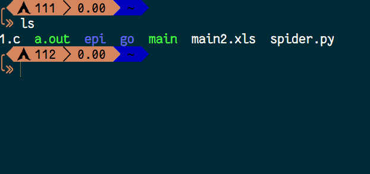

## Linux命令入门篇
在往下阅读前提示，`$`是代表着普通用户，不是输入$<br>
`.`代表着`当前文件夹`<br>
`..`代表着上一个文件夹<br>
`/`为根目录<br>
`~`为用户目录<br>
这些命令大部分同样在Mac OS上使用，因为他们的Shell都是bash<br>
不适用的我会给出详细标注<br>
学完这些，你应该会的是：
* 查看目录
* 查看环境变量
* 运行程序
* 查看文本文件的内容
* 知道自己姓甚名谁
* 创建/删除 文件/文件夹
* 关机与重启
* 拷贝文件
* 知道自己在哪个路径
* 创建环境变量
* 用自己喜欢的方式简写命令
* 纯命令行的编辑文本

### echo
和win下的cmd同理，但是会有细微差别
```shell
$ echo "Hello World"
```
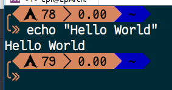

### ls - list
`ls`命令的作用和win上的`dir`一样，是列出当前目录下的文件和文件夹的
```shell
$ ls
```
默认会出来非隐藏的文件和文件夹<br>
如果要查看隐藏文件，请使用：
```shell
$ ls -a
```
这些都是仅仅的打印出来，如果要列表并且查看那个文件/文件夹的权限，请使用：
```shell
$ ls -l
```
又想查看隐藏文件又想列表呢？
```shell
$ ls -la
```


### cd
和win下的cd是一样的<br>
去根目录用
```shell
$ cd /
```
回到主目录用
```shell
$ cd ~
```
或者是
```shell
$ cd
```
### whoami - 我是谁
```shell
$ woami
```
此命令执行后输出当前用户的名字

### mkdir - 创建文件夹
和win下同理，创建目录用的

### cat - 拼接文件
cat和win下的more类似
如果你单纯的想查看`一个文件`
```shell
$ cat [filename]
```
如果你想把两个文件的内容`拼接`起来
```shell
$ cat [file1name] [file2name]
```
如图<br>


### rm - 删除文件
rm 命令是用来删除文件/文件夹的
```shell
$ rm 1.c
```
这样是删除那个叫做`1.c`的文件。若要删除文件夹，请使用：
```shell
$ rm [repo name] -rf
```
递归删除一个文件夹，删除里面所有的内容<br>
提示，不加`-rf`是不会通过的，因为不是文件

### pwd - 显示完整路径
在Linux的命令行里，默认不显示路径全部内容的
```shell
$ pwd
```
用`pwd`来确认当前所在路径

### cp - 拷贝文件
```shell
$ cp [file] [path]
```
图上的命令为例子：<br>
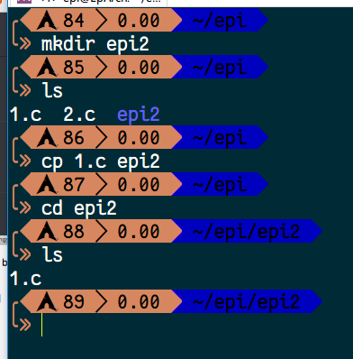


### sha256sum - 查看文件的文件指纹（Mac环境不适用）
我们从网上下载一个东西的时候，为了安全我们是需要验证文件指纹的
```shell
$ sha256sum [filename]
```
输出的就是那个文件的sha256sum<br>
<br>
当然有的时候只有sha1sum，那就
```shell
$ sha1sum [filename]
```
<br>

### sudo - "super user do"
这是一个带有管理员权限的命令。安装程序，关机等都需要这个命令
```shell
$ sudo [command]
```
怎么样判断你需不需要这个命令？如果你执行某一个命令的时候出现了`Permission denied`、`Permission`等等字眼，那就是权限不够了<br>
<br>
比如说，一台服务器，支撑着某个程序的后台或者某个网站，肯定是不允许随随便便关机的。但是有时候一起负责这个服务器的某个人要登录上去修改数据，但是项目里不允许他进行开关机等带有权限的操作，boss就不会给它开放sudo<br>
把自己添加进sudo是另一门学问了……

### shutdown/reboot - 关机和重启
```shell	
$ sudo shutdown
```
直接敲`sudo shutdown`是一分钟后关机，取消这个关机用
```shell
$ sudo shutdown -c
```
c是`cancel`的意思
```shell
$ sudo shutdown now
```
这是直接关机<br>
```shell
$ sudo reboot
```
这是重启

### 执行当前目录下的文件
```shell
$ ./[filename]
```
比如我们有一个写好了的程序叫做`main`，执行它
```shell
$ ./main
```
`./`是为了区分当前目录和其它目录里已经添加了`环境变量`的程序区分开来，`.`代表着当前目录。你可能会问为什么代表了当前目录还要加`/`，这是因为Linux的文件规则是`隐藏文件以.开头`，`./main`的意思是当前`目录下的那个叫做main的程序`，`.main`代表着一个叫做`.main`的文件或文件夹，但不是当前目录，而是环境变量里的。所以这两个就不是一个意思了<br>


### > - 将输出写进文本
这个不能算命令，它只是作为重定向的一个“工具”。我们有时候会需要把程序里的输出记录下来，这时候就要用到`>`<br>
做一个简单的例子吧，我们都知道`echo "Hello World"`会把Hello World输出到屏幕上对不对，那么我们现在把这个输出写进文本里，假定那个文本文件就叫做`1.txt`，那命令就是这个样子的
```shell
$ echo "Hello World" > 1.txt
```
`>`的前面是命令，后者是输出的文件名字<br>
如图：<br>
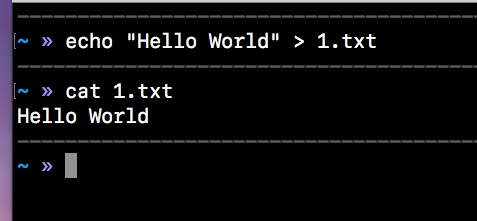<br>
当然，你也可以运行一个HelloWorld程序来写入到文本，完全可以<br>
学习的过程中要学会举一反三

### env - 查看环境变量
环境变量简单的解释就是，装着路径的变量。用户执行命令的时候会在已有的环境变量里寻找，看看是否有这个命令，没有的话就会提示`command not found`<br>
```shell
$ env
```
当然你可以用`echo`来查看单独的变量，例如
```shell
$ echo $HOME
```
就会出现<br>
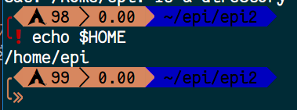

### export - 添加环境变量
```shell
$ export NAME="~"
```
上面的命令意思是，创建了一个叫做`NAME`的环境变量，它的路径是`~`<br>
`cd`来看看是不是正确的<br>
```shell
$ cd $NAME
```


### alias - 用自己喜欢的别名命名命令
有的时候一个命令很长很长，但是你又不想敲的这么累，你就可以这么做
```shell
$ alias DISMISS="sudo shutdown now"
```
上面的意思是，我把`sudo shutdown now`简写成了`DISMISS`，这样执行`$ DISMISS`就等于执行了`$ sudo shutdown now`<br>
当然，这样子只能本次运行有效。若要长久有效，请写到`.bashrc`、`.zshrc`之类的文件里，后续章节会讲到

### nano - 命令行下的“可视化”编辑器
假定你所使用的Linux是没有GUI的，只有一台显示器和键盘，那么我们要编辑文本的话，用`echo`不太现实，所以我们用nano来编辑文本文件
```shell
$ nano 
```
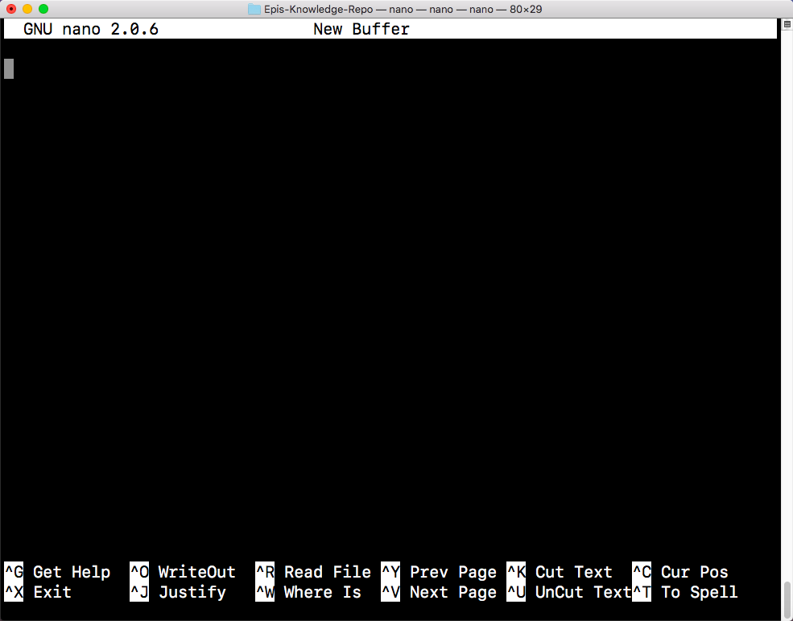<br>
于是我们打开了一个编辑器，这个就可以直接写东西了。控制就用方向键的上下左右<br>
写完之后按下`ctrl + O`来保存（Mac上是`Control键 + O`），接着会让你写保存的文件名，写完按下回车就好了<br>
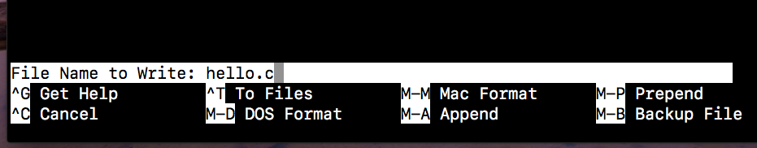
退出的话，用`ctrl + X`<br>
如果要打开现有文件，把文件名字作为参数名
```shell
$ nano Hello.c
```
在编辑的时候，用`ctrl + V`翻到下一页，`ctrl + Y`翻到上一页。`ctrl + P`跳到下一行，`ctrl + X`跳到上一行<br>
这些命令就已经足够使用来编辑文本了，要想了解更多，在打开nano后按下`ctrl + G`

## Linux命令 - 初阶

### tail - 大文本的查看末尾
有时候一个文件打开时候很大，但你又不想像cat那个样子全部阅读，我只需要那末尾的几行

## 未完待续……