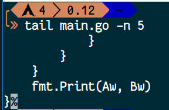

# Terminal Tutorial #

本文旨在介绍终端，命令行，以及常用命令

## 什么是命令行 ##

简要的来说，就是运行一类程序的环境。由于它的显示是一行一行的，所以我们把它叫做命令行


命令行程序运行的时候会出现一个黑黑的窗口(初学 C 语言和 Java、Python 等命令行程序的应该都有所体会)，这个叫做 `Shell`，它是负责和程序交互的。我们给程序输入东西的时候，会等待回车，然后Shell把你输入的内容和回车一起带给你的程序。程序输出东西的时候，把内容交给Shell，Shell会帮我们打印出来


Windows下的 `cmd` 是一种 Shell；最近微软搞了个非主流的东西，叫做 `PowerShell`，也是一种Shell；如果你另外安装了 `cmder` 啊 `ConEmu` 啊 `Git Bash` 啊，也是一种 Shell；Linux 下的 `Bash` 也是一种 Shell，等等等等。这些都是 Shell 的实例，就好比二哈、阿拉斯加、日天迪都是狗一样。本文旨在介绍一些命令和不同 Shell 之间的些许差别

## 命令行的起源 ##

上世纪 70 年代的时候，那会还没有图形用户界面(GUI)，有的就是一个显示器，一个键盘，操纵电脑用的就是一行一行的命令。当时的系统是 Linux，所以命令行也是 Linux 比 Windows 更专业

后来GUI被开发出来后，人们的日常使用就变成了鼠标和界面，而不是比较专业的命令，命令留给了服务器等等领域

工程师可能不能随时守在服务器的旁边，但是如果要使用服务器，就必须用一个叫做 `ssh` 的程序来登录，远程执行命令。但为什么用 Linux 做服务器而不用 Windows 呢？首先，Linux 有 Minimal 版的系统，就是纯命令行，没有 GUI，这样减少了系统占用，尤其是内存。我们都知道现在 Win10 下 4G 内存平常使用都够呛，但是一个 Minimal 版的 Linux 的占用是多少？

我运行了一个没有图形界面的 Arch Linux，执行命令查看

```shell
$ free -mh  # 前面的 $ 号叫做 prompt，提示你在一个 REPL 环境下，不需要输入，如果是 root 用户会变成#，cmd 下是 >，Mac 和 Windows 下的 cmd 无此命令
```

结果是：


只用了 72M，如果有图形呢？

我们在有界面的 Ubuntu 下执行相同的命令


结果相差了五百多M，这个占用是很大的

作为服务器的话，没有 GUI 可以让这一部分资源用来运行其它的程序，使效率更高。而且现在的命令行程序运行速度都很快，比如 C、Go 语言写的程序等

## 我怎样能找到我自己电脑上的 Shell？ ##

### 如果你在 Windows ###

使用 `Windows + R` 键，即可调出一个叫做运行的窗口


然后输入 `cmd`，回车

或者，打开开始菜单，搜索框里输入 cmd，找到命令提示符


### 如果你在Mac OS ###

从桌面上进去 Launch Pad


找到终端，打开它


### 如果你是 Linux ###

#### 如果你有 GUI ####

Ubuntu 下点击左上角的 Ubuntu 标志，搜索 Terminal，打开终端


CentOS 等等也基本类似

#### 如果你没有 GUI ####

那就直接是命令行

## 命令行界面的组成部分 ##


### 路径 ###


红线部分就是路径，意思是这个命令窗口当前所在的位置

比如说，我们要运行某一个程序，如果不用快捷方式的话，就得过去他所在的那个文件夹，双击运行，对不对？那么命令行也是同理的

### 光标 ###

和记事本、Word 一样，光标所在的区域是让你输入命令的

## 我们用几个命令来入门 CMD ##

其它系统平台请略过，往后看

### 第一个命令 ###

``` batch
> echo 你好，命令行
```

上方的阴影区域就是我们要输入进去的命令，其中由三个部分组成


`>` 是 prompt，默认存在，所以我们只需要输入 `echo 你好，命令行`

`echo` 是我们要运行的程序，中间有一个空格，`你好，命令行`是我们给它的参数

参数的意思是，我在程序启动的时候给了它一些东西，它会把这个东西拿去使用，比如在 C 语言里，我们读进一个数然后再输出，参数实际上是运行前就给它了

敲完之后我们敲`回车`


然后屏幕上出来了`你好，命令行`，这个是`程序的输出`

你也可以

``` batch
> echo "Hello World"
```

在命令行程序里，给定参数的时候，如果参数中间有空格，用双引号把它包起来


### 列出当前目录的东西 - dir ###

```batch
> dir
```

这个命令是列出当前路径下的所有`文件`和`文件夹`


每一行中标了`<dir>`的为文件夹(diretory)

### 新建一个文件夹 - mkdir ###

``` batch
> mkdir epi
```

这个命令是用来新建文件夹的，我们可以用 `dir` 来看创建的结果


`epi` 只是我用来做实验的，当然你们可以自己起名字

上图中我用`管理员权限`打开的，因为在C盘某些文件夹下新建文件夹等操作会涉及权限问题

### 删除文件 - del ###

```batch
> del xxx.jpg
```

这样，就可以删掉那个叫做 `xxx.jpg` 的图像文件了

你可以使用 `dir` 来查看删除的结果

### Goto Anywhere - cd ###

既然涉及了路径，有的时候我们要去别的路径下，那么要使用 `cd` 命令，带我们过去

```batch
> cd epi
```

意思是进入一个叫做 `epi` 的文件夹


这时候我们就会看到，路径变了

如果我们有一个文件夹的名字是`带了空格`的呢？那就加上双引号


回到上一个文件夹怎么办呢？

```batch
> cd ..
```

`cd` 加上一个空格再写两个 `.`


记得参数之间是有空格的

如果你不想一直敲 cd 进入某个文件夹，你想一次进入，可以把地址复制下来


```batch
> cd [你所复制的内容]
```

然后就会快速的过去了


我们的电脑硬盘一般都有几个分区，如果要切换，就敲那个`盘符`+`半角冒号`，如：

```batch
> D:
```


这样就会去到 D 盘了

操作上述那个复制路径的命令的前提是，盘符相同。如果不相同，先换所在分区再操作

### 运行目录下面的程序 ###

假定我们现在有一个叫做 `Hello.exe` 的用 C 语言说 Hello 的程序，就在我们所在的目录下


直接敲名字即可运行(也可以带上那个 `.exe`)

```batch
> Hello
```


然后你会发现，不用加上 `system("pause")` 也不会闪退

### 清空屏幕上的文字 - cls ###

命令敲多了，命令窗口总会有一堆文字，我们需要清屏命令来清除它

* Before


```batch
> cls
```

* After


### 打开某一个文本文件 - more ###

`more` 命令会把参数所表示的文件的内容输出到屏幕上

```batch
> more 1.c
```


### 快速补全 ###

我们都知道，如果某一个命令又臭又长，敲起来会很难受

假定我们还是那个 `Hello World` 文件夹


`cd` 时候敲一个 `H`，接着按下键盘上的 `Tab` 键，也就是切换大写的上面那个，就会出现完整的" Hello World "

当然，这里只敲一个 H 是因为目录下只有一个以 H 开头的文件/文件夹，如果有多的，就输入直到那个字母`仅有一个可配对`的为止


## Linux命令入门篇 ##

在往下阅读前提示，`$` 是代表着普通用户，不是输入$

`.` 代表着`当前文件夹`

`..` 代表着上一个文件夹

`/` 为根目录

`~` 为用户目录

你可以在 [Ubuntu 官网](http://cn.ubuntu.com/)，[CentOS 官网](https://www.centos.org/) 等地方下载一个桌面版的 Linux 来练习接下来的这些命令

这些命令大部分同样在 Mac OS 上适用，因为他们的 Shell 都是 bash

不适用的我会给出详细标注

学完这些，你应该会的是：

* 查看目录
* 查看环境变量
* 运行程序
* 查看文本文件的内容
* 知道自己姓甚名谁
* 创建/删除 文件/文件夹
* 关机与重启
* 拷贝文件
* 知道自己在哪个路径
* 创建环境变量
* 用自己喜欢的方式简写命令
* 纯命令行的编辑文本

### echo ###

和 win 下的 cmd 同理，但是会有细微差别

```shell
$ echo "Hello World"
```


### ls - list ###

`ls` 命令的作用和 win 上的 `dir` 一样，是列出当前目录下的文件和文件夹的

```shell
$ ls
```

默认会出来非隐藏的文件和文件夹

如果要查看隐藏文件，请使用：

```shell
$ ls -a
```

这些都是仅仅的打印出来，如果要列表并且查看那个文件/文件夹的权限，请使用：

```shell
$ ls -l
```
又想查看隐藏文件又想列表呢？
```shell
$ ls -la
```


### cd ###

和 win 下的 cd 是一样的

去根目录用

```shell
$ cd /
```

回到主目录用

```shell
$ cd ~
```

或者是

```shell
$ cd
```

### whoami - 我是谁 ###

```shell
$ woami
```

此命令执行后输出当前用户的名字

### mkdir - 创建文件夹

和win下同理，创建目录用的

### cat - 拼接文件

cat 和 win 下的 more 类似

如果你单纯的想查看`一个文件`

```shell
$ cat [filename]
```

如果你想把两个文件的内容`拼接`起来

```shell
$ cat [file1name] [file2name]
```

如图


### rm - 删除文件

rm 命令是用来删除文件/文件夹的

```shell
$ rm 1.c
```

这样是删除那个叫做 `1.c` 的文件。若要删除文件夹，请使用：

```shell
$ rm [repo name] -rf
```

递归删除一个文件夹，删除里面所有的内容

提示，不加 `-rf` 是不会通过的，因为不是文件

### pwd - 显示完整路径 ###

在 Linux 的命令行里，默认不显示路径全部内容的
```shell
$ pwd
```

用 `pwd` 来确认当前所在路径

### cp - 拷贝文件

```shell
$ cp [file] [path]
```

图上的命令为例子：


### sha256sum - 查看文件的文件指纹（Mac 环境不适用）

我们从网上下载一个东西的时候，为了安全我们是需要验证文件指纹的
```shell
$ sha256sum [filename]
```

输出的就是那个文件的 sha256sum


当然有的时候只有 sha1sum，那就

```shell
$ sha1sum [filename]
```


### sudo - "super user do"

这是一个带有管理员权限的命令。安装程序，关机等都需要这个命令

```shell
$ sudo [command]
```

怎么样判断你需不需要这个命令？如果你执行某一个命令的时候出现了 `Permission denied`、`Permission` 等等字眼，那就是权限不够了


比如说，一台服务器，支撑着某个程序的后台或者某个网站，肯定是不允许随随便便关机的。但是有时候一起负责这个服务器的某个人要登录上去修改数据，但是项目里不允许他进行开关机等带有权限的操作，boss 就不会给它开放 sudo

把自己添加进 sudo 是另一门学问了……

### shutdown/reboot - 关机和重启

一分钟后关机：
```shell
$ sudo shutdown
```

取消这个关机：

```shell
$ sudo shutdown -c    #c 是 cancel 的意思
```

立即关机：

```shell
$ sudo shutdown now
```

重启系统：

```shell
$ sudo reboot
```

### 执行当前目录下的文件 ###

```shell
$ ./[filename]
```

比如我们有一个写好了的程序叫做 `main`，执行它

```shell
$ ./main
```

`./`是为了区分当前目录和其它目录里已经添加了`环境变量`的程序区分开来，`.`代表着当前目录。你可能会问为什么代表了当前目录还要加 `/`，这是因为 Linux 的文件规则是`隐藏文件以.开头`，`./main` 的意思是当前`目录下的那个叫做 main 的程序`，`.main`代表着一个叫做 `.main` 的文件或文件夹，但不是当前目录，而是环境变量里的。所以这两个就不是一个意思了


### > - 将输出写进文本

这个不能算命令，它只是作为重定向的一个“工具”。我们有时候会需要把程序里的输出记录下来，这时候就要用到 `>`

做一个简单的例子吧，我们都知道 `echo "Hello World"`会把 Hello World 输出到屏幕上对不对，那么我们现在把这个输出写进文本里，假定那个文本文件就叫做 `1.txt`，那命令就是这个样子的

```shell
$ echo "Hello World" > 1.txt
```

`>` 的前面是命令，后者是输出的文件名字

如图：


当然，你也可以运行一个 HelloWorld 程序来写入到文本，完全可以

学习的过程中要学会举一反三

### env - 查看环境变量

环境变量简单的解释就是，装着路径的变量。用户执行命令的时候会在已有的环境变量里寻找，看看是否有这个命令，没有的话就会提示 `command not found`

```shell
$ env
```

当然你可以用 `echo` 来查看单独的变量，例如

```shell
$ echo $HOME
```

就会出现


### export - 添加环境变量

```shell
$ export NAME="~"
```

上面的命令意思是，创建了一个叫做 `NAME` 的环境变量，它的路径是 `~`

`cd` 来看看是不是正确的

```shell
$ cd $NAME
```


### alias - 用自己喜欢的别名命名命令

有的时候一个命令很长很长，但是你又不想敲的这么累，你就可以这么做

```shell
$ alias DISMISS="sudo shutdown now"
```

上面的意思是，我把 `sudo shutdown now` 简写成了 `DISMISS`，这样执行 `$ DISMISS` 就等于执行了`$ sudo shutdown now`

当然，这样子只能本次运行有效。若要长久有效，请写到 `.bashrc`、`.zshrc` 之类的文件里，后续章节会讲到

### nano - 命令行下的“可视化”编辑器

假定你所使用的 Linux 是没有 GUI 的，只有一台显示器和键盘，那么我们要编辑文本的话，用 `echo` 不太现实，所以我们用 nano 来编辑文本文件

```shell
$ nano
```


于是我们打开了一个编辑器，这个就可以直接写东西了。控制就用方向键的上下左右

写完之后按下 `ctrl + O` 来保存（ Mac 上是 `Control键 + O`），接着会让你写保存的文件名，写完按下回车就好了


退出的话，用 `ctrl + X`

如果要打开现有文件，把文件名字作为参数名

```shell
$ nano Hello.c
```

在编辑的时候，用 `ctrl + V` 翻到下一页，`ctrl + Y` 翻到上一页。`ctrl + P` 跳到下一行，`ctrl + X` 跳到上一行

这些命令就已经足够使用来编辑文本了，要想了解更多，在打开 nano 后按下 `ctrl + G`

## Linux 命令 - 初阶 ##

### tail - 大文本的查看末尾 ###

有时候一个文本打开时候很大，但你又不想像 cat 那个样子全部阅读，我只需要那末尾的几行或者那些字符，就要用到 tail 命令

假定我们现在有一段代码，文件名字叫做 main.go，内容是这样的

```go
package main

import "fmt"

func main() {
    var Time, A, Ah, B, Bh int
    var Aw, Bw int
    Aw = 0
    Bw = 0
    fmt.Scanf("%d\n", &Time)
    for i := 0; i < Time; i++ {
        fmt.Scanf("%d %d %d %d\n", &A, &Ah, &B, &Bh)
        sum := A + B
        if Ah == sum {
            if Bh == sum {
                continue
            } else {
                Bw++
            }
        } else {
                if Bh == sum {
                Aw++
            }
        }
    }
    fmt.Print(Aw, Bw)
}
```

我们要查看它的后面五行，命令为

```shell
$ tail main.go -n 5
```

也可以

```shell
$ tail main.go --line 5
```

```shell
$ tail main.go    #这是默认末尾十行
```



如果是后面的 30 个字符，命令为

```shell
$ tail main.go -c 30
```


你也可以同时查看多个文件的末尾，例如

```shell
$ tail main.go spider.py
```


它会默认显示十行并根据你的参数顺序来打印每个文件，加上文件名字

如果你不想显示这个文件名字：

```shell
$ tail main.go spider.py --quiet
```

### which - 查看命令程序的位置 ###

上一章讲环境变量的时候就提到过了，如果你想在当前目录下执行其他目录下的程序，要么加上路径，要么添加环境变量。如果你添加了环境变量，可以直接使用某个程序，那你想看到它具体在文件系统的哪个位置的时候：

```shell
$ which [command]
```

例如：

```shell
$ which ls      # 查看 ls 命令的位置
$ which sudo    # 查看 sudo 命令的位置
```

### w - 几人登录了这台机子 ###

服务器是需要登录使用的嘛，哪怕在物理机上直接用也是需要登录的对不对。但是协同工作的需要，一台机子不只是像 Windows 那样只能一个人在用，很多人可以同时登录这台机子。这时候就可以查看有多少人登录了这台机子

```shell
$ w
```

给一个输出样例

```
21:20:02 up 20 min,  2 users,  load average: 0.00, 0.00, 0.00
USER     TTY        LOGIN@   IDLE   JCPU   PCPU WHAT
epi      tty1      21:19    3.00s  0.02s  0.02s -zsh
epi      pts/0     20:59    0.00s  0.10s  0.00s w
```

此图上的 USER 就是用户名了；TTY 指的是你登录的终端类型；LOGIN@ 是登录的时间；IDLE 为用户的空闲时间，指的是显示这个信息到上一次你输入命令的间隔；JCPU 指的是和该终端连接的所有进程占用时间，包括前台和后台；WHAT 是当前正在运行进程的命令行

一些参数说明

```shell
$ w -h, --no-header     # 不打印 USER、TTY 等标题
$ w -o, --old-style     # 旧式输出风格
$ w -V, --version       # w 命令的当前版本
$ w -s, --short         # 简化输入的内容
$ w -i, --ip-addr       # 显示登陆者的 IP 地址(如果可以)
$ w -f, --from          # 显示登陆者的机子名称
```

### >> - 追加

在入门的时候我们说过 `>` 是将输出重定向到文件的，也就是将输出写入。但是这个操作是会覆盖原来的内容的，意思是原来文件里有内容的话，这个操作就会把原来的内容删掉后写入新的内容

如果是往文件末尾追加，就可以用 `>>`

```shell
$ echo "Hello World" >> 1.txt
```

## 未完待续……