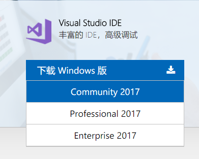
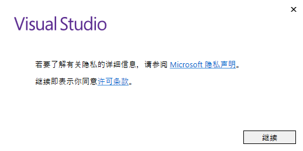
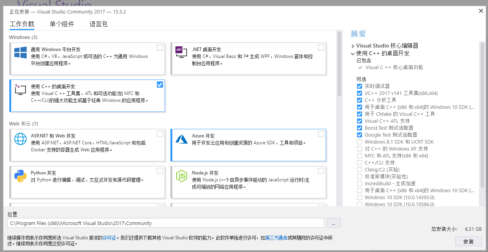
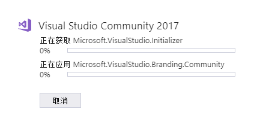
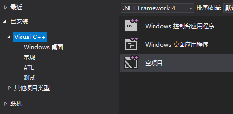
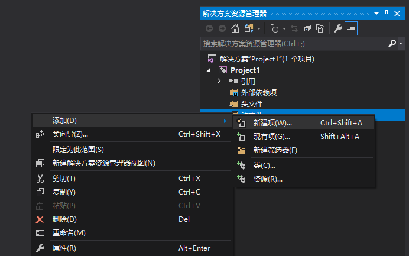
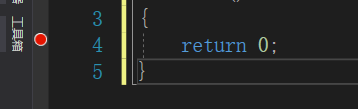
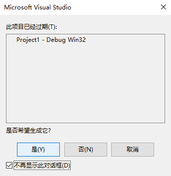
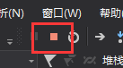
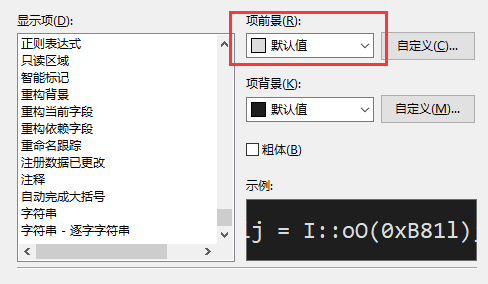

# Visual Studio Tutorial

在讨论区里有看到问怎么用 VS 的，我第一次安装的时候也不是那么一帆风顺，那就讲一讲吧。

## 配置建议

不小于 4G 的内存和不小于 2.2 Ghz 的处理器，以及至少 5G 的磁盘空间。虚拟机的话加上系统大概会占掉 20G 的空间。如果你尚未达到这个标准，我建议你用 Dev-C++ 或者命令行工具 gcc

## 下载并安装

到 Visual Studio 的[官网](https://www.visualstudio.com/zh-hans/)下载

下方有一个 Visual Studio IDE，鼠标移到`下载 Windows 版`处，会有一个下拉菜单，选择 `Community`

之后会打开一个页面，VS 的 Installer 会开始下载，大概是一兆多

下载完成后，运行，接受他的协议，点继续

接着 Installer 会下载它的文件并安装，等待它安装完成

注意，此处安装的是 Installer，而不是真正的 IDE，Installer 是帮助我们管理 VS 的各项可选功能的

进度条走完之后，会自动打开 Installer 的主界面。如果你是开发 C/C++ 的，就选 C++ 桌面开发；如果你做的是 C# 开发，选择 .NET 桌面开发。打钩即可

位置尽量默认，如果你是机械盘的话，自己选择路径也可以。之后点安装

C++ 到了现在大概是 6.3G (包括 IDE 本身)，安装过程会很久，请耐心等待

走进度条的时候，再次确认你安装的是 Community 版本的 Visual Studio

等到安装成功的界面出来，就可以点击启动来使用了

仍然要题型，Installer 不是 IDE，创建快捷方式的时候要找对，不然还得再启动一遍

## 第一次使用

第一次启动会让你登录，你也可以点击以后再说，但是要在一个月内登录。不收费，申请一个微软账号就好

颜色主题就根据自己喜好来就好，开发设置根据你自己，默认常规

点击启动 Visual Studio

## 新建一个项目(特指 C/C++)

主界面中间的 `创建项目` 下面有一个 `创建新项目`，或者菜单栏 -> 文件 -> 新建 -> 项目

切记，和 VC6, Dev 不同，VS 不允许你**新建文件就编译**，一切程序的前提是项目

弹出来的窗口里左边点击 Visual C++，右边选择空项目，下方给你的项目起名字。也可以保持默认，但这样不利于以后找文件

点击确定，VS 会开始帮你创建一个项目。完成后窗口的右边有一个 解决方案资源管理器，在里面的`源文件`处右键 -> 添加 -> 新建项

新的弹窗选择 C++ 文件，文件名字可以自定，但要保证是 .c 或者 .cpp 后缀，之后点击确定

接着就会出来编辑器让你写东西了

## 运行程序

写好之后，在 `return 0;` 的位置加上一个断点，点击上方的`本地 Windows 调试器`

VS 会提示此项目已经过期，是否希望生成它？打钩 `不再显示此对话框`，点击 是

加断点的意思是不让程序直接退出，和 `system("pause")` 是一个道理的

如果你加的是断点，退出的时候点击上方的停止按钮

## scanf 等函数报不安全的解决方法

请参照 https://github.com/m4XEp1/Epis-Knowledge-Repo/blob/master/Why%20scanf_s/README.md

## 一些美化

### 更改字体

菜单栏 -> 工具 -> 选项 -> 字体和颜色，推荐使用 `Consolas`，平滑，等宽，也是 Dev-C++ 的默认字体

### 更改某些关键字的颜色

比如函数名称，局部变量，形参，常量，注释等

在`显示项`处，选择你要改变的项，接着在`项前景`换成你想要的颜色

## 一个项目一个 main 函数

千万记得，一切程序的前提是项目，不要像 VC6 那样新建文件就写了。如果你要写新的程序，先关闭当前的解决方案

文件 -> 关闭解决方案

接着再新建一个项目

## 可能还有东西要补充

未完待续……