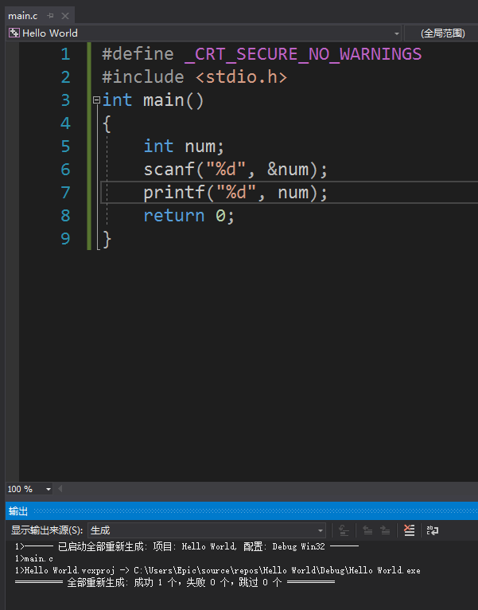
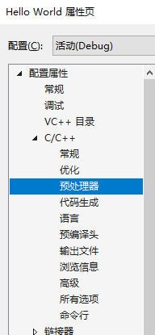
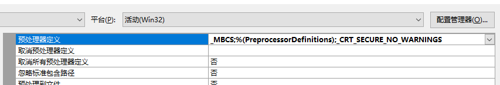

# VS下为什么要用scanf_s？

在mooc讨论区啊或者生活中，遇到了很多问这个问题的。原本我自己的解释是：`scanf`对于微软来说不安全，它建议你用`scanf_s`。
后来想想，为什么不安全，好像我也没有真正去探索过，不如借这个机会去了解一下看看

## 写一段“不安全”的代码

```c
#include <stdio.h>
int main()
{
    int num;
    scanf("%d", &num);
    printf("%d\n", num);
    return 0;
}
```

准备运行的时候，下方出现了错误，提示

`'scanf':This function maybe unsafe. Consider using scanf_s instead. To disable deprecation, use _CRT_SECURE_NO_WARNINGS.see online help for details`

这句话的翻译是：scanf这个函数可能不安全，考虑用scanf_s代替。要禁用弃用警告，使用`_CRT_SECURE_NO_WARNINGS`。详情请查看在线帮助

那就去看看在线帮助呗，[走你](https://docs.microsoft.com/en-us/cpp/error-messages/compiler-warnings/compiler-warning-level-3-c4996)

你可能会头疼，没关系，我把它给引用过来

在页面上这个C4996的错误有三个原因造成，我们只看那个unsafe的详情

## msdn原文

### Unsafe CRT Library functions

**This function or variable may be unsafe. Consider using** _safe_version_ **instead. To disable deprecation, use _CRT_SECURE_NO_WARNINGS. See online help for details.**

Microsoft has deprecated some CRT and C++ Standard Library functions and globals in favor of more secure versions. In most cases, the deprecated functions allow unchecked read or write access to buffers, which can lead to serious security issues. The compiler issues a deprecation warning for these functions, and suggests the preferred function.

To fix this issue, we recommend you use the function or variable safe_version instead. If you have verified that it's not possible for a buffer overwrite or overread to occur in your code, and you cannot change the code for portability reasons, you can turn off the warning.

To turn off deprecation warnings for these functions in the CRT, define **_CRT_SECURE_NO_WARNINGS**. To turn off warnings about deprecated global variables, define **_CRT_SECURE_NO_WARNINGS_GLOBALS**. For more information about these deprecated functions and globals, see [Security Features in the CRT](https://docs.microsoft.com/en-us/cpp/c-runtime-library/security-features-in-the-crt) and [Safe Libraries: C++ Standard Library](https://docs.microsoft.com/en-us/cpp/standard-library/safe-libraries-cpp-standard-library).

## 翻译

### 不安全的库函数

**这个函数或者变量可能不安全，考虑用**_安全的版本_**替代。要禁用弃用警告，使用 _CRT_SECURE_NO_WARNINGS。查看在线帮助获取更多信息**

微软已经弃用了一些CRT和C++标准库函数和全局变量，以支持更安全的版本。在大多数情况下，弃用函数允许对缓冲区进行未检查的读或写访问，这会导致严重的安全问题。编译器为这些函数发出一个弃用警告，并建议首选函数。

为了解决这个问题，我们建议您使用函数或变量 _安全的版本_ 替代。如果您已经验证了在您的代码中不可能出现缓冲区覆盖或过读，而且由于可移植性的原因不能更改代码，您可以关闭警告。

为了关闭CRT中这些函数的警告，请定义 **_CRT_SECURE_NO_WARNINGS**。要关闭对不受欢迎的全局变量的警告，请定义 **_CRT_SECURE_NO_WARNINGS_GLOBALS**。有关这些弃用函数和全局变量的更多信息，请参见[CRT中的安全特性](https://docs.microsoft.com/en-us/cpp/c-runtime-library/security-features-in-the-crt)和[安全库:C++标准库](https://docs.microsoft.com/en-us/cpp/standard-library/safe-libraries-cpp-standard-library)。

## 原理

原来的scanf对缓冲区的操作之前没有进行检查，所以微软认为这是**不安全的**

## 解决方法

### 1 - 使用scanf_s (不推荐)

你觉得 scanf_s 安全，那我就用 scanf_s 呗。但是这么做，你的代码再改回来之前是不可移植的哦

如果以后用了别的函数或者变量名字也遇到了同样的问题，根据下方的错误提示来修改函数名字即可，但问题也一样，这不可移植

什么是可移植？就是你的代码拿去其它平台能通过，就叫可移植。比如Linux，macOS

### 2 - 定义 _CRT_SECURE_NO_WARNINGS

在程序上方加上一句

```c
#define _CRT_SECURE_NO_WARNINGS
```

像这样

```c
#define _CRT_SECURE_NO_WARNINGS
#include <stdio.h>
int main()
{
    int num;
    scanf("%d", &num);
    printf("%d\n", num);
    return 0;
}
```

再编译，一点问题都没有



### 3 - 添加预定义

在菜单栏的上方 -> `项目` -> `属性` ，打开之后会有一个窗口，找到`C/C++` -> `预处理器`



在第一个预处理器定义上，在末尾加上一个**半角分号**，然后粘贴

```c
CRT_CECURE_NO_WARNINGS
```

像这样：



前面的部分可能会不同，不要在意，只要添加上去的内容是正确的就行了

另外说一下，如果你这么做了，代码里就不要再define上面那一句了